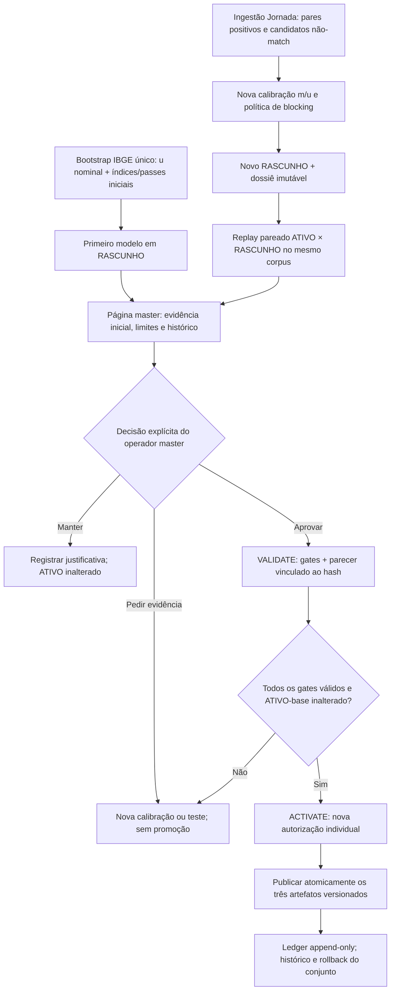

# DT-15 — dossiê comparativo e página de decisão do modelo

**Decisão de produto/arquitetura (27/09/2026):** o objeto principal da decisão é a comparação **atual × proposto** nas mesmas condições de avaliação, não uma classificação histórica de modelos. O histórico agregado continua disponível como contexto. O **Monitor Operacional** e a **página restrita de governança para o operador master** são superfícies distintas, com permissões, responsabilidades e efeitos diferentes.

**Estado registrado em 27/09/2026 (contexto histórico):** implementação **parcial naquela data**. O wrapper Windows encerra em RASCUNHO após a conferência; o Worker persiste comparação dos passes D ATIVO×RASCUNHO sobre a mesma amostra rotulada. Uma **prévia DEV somente leitura** da página master em `/governanca/modelos`, com permissão exclusiva `jornada.modelos.governanca.read`, apresenta ATIVO, RASCUNHO, evidência parcial e histórico compacto, sem compartilhar o scope do Monitor. **A página master de decisão em HML/Produção, o dossiê FS completo, a identidade corporativa e os gates de aprovação humana ainda não implementados permanecem requisitos obrigatórios.** A prévia não habilita `VALIDATE`/`ACTIVATE` e não demonstra validade estatística populacional. Vinculado ao [Plano de desenvolvimento](Plano_Desenvolvimento.md), detalhado em [Dívidas técnicas](Dividas_Tecnicas.md) e distinto de DT-14, DT-09, DT-05 e Trilha 4.

**Reconciliação em 08/10/2026:** a **DT-15 foi concluída no escopo de governança técnica DEV em 03/10** (PRs [#713](https://github.com/lucianox777/Jornada/pull/713)–[#715](https://github.com/lucianox777/Jornada/pull/715)). Existem ledger append-only de decisão, vinculação por hash de dossiê/fingerprint/modelo ATIVO-base e proteção transacional anti-TOCTOU. O replay sintético incompleto continua marcado como **INCOMPLETO/SINTETICA_DEV**, sem constituir aprovação ou evidência representativa. A página master DEV não autoriza ativação baseada em dados sintéticos. **HML/Produção continuam bloqueadas** por identidade corporativa, autorização institucional, evidências representativas e decisão humana válida. O texto de situação parcial de 27/09 abaixo preserva o histórico da implementação anterior, não reabre a dívida técnica DEV nem descreve o estado atual completo. Ver [Dívidas técnicas](Dividas_Tecnicas.md#ordem-proposta-e-critérios-de-aceite).

## 1. Duas superfícies sem confusão de responsabilidade

| Superfície | Finalidade | Usuários e privilégio | Mutação de modelo |
|---|---|---|---|
| [Monitor Operacional](Monitor_Operacional.md), rota existente `/monitor` | Estado atual do sistema, saúde, alertas, modelo ATIVO, resumo do último RASCUNHO, condição da comparação e link para a página restrita quando autorizada | Operadores com `jornada.monitor.read` segundo o contrato já publicado; **sem** exposição de parâmetros/thresholds sensíveis nem detalhes de pares | **Nunca**; o monitor não valida, aprova, rejeita nem ativa |
| **Página de governança de modelos**, rota **proposta** `/governanca/modelos` | Revisão do dossiê atual × proposto, explicação das divergências, histórico compacto, registro da decisão humana e ações separadas `VALIDATE`/`ACTIVATE` | **Operador master autorizado** por identidade individual corporativa e permissão explícita de leitura/decisão de modelo; não reaproveitar indiscriminadamente `jornada.monitor.read` | Somente APIs específicas com autorização centralizada, auditoria, estado/fingerprint vinculado e gates em transação |

A página não é uma extensão de autenticação da rota `/monitor`. Aplicar `Jornada.Access.Security` (DT-04) às APIs específicas; a matriz de acesso deve distinguir visualizar comparação, registrar decisão, validar e ativar, sem pressupor que um gestor de Secretaria ou qualquer portador da credencial de monitor tenha papel master. Em HML/Produção, **deny-by-default** enquanto a autorização e identidade corporativa individual necessárias não estiverem homologadas (dependência institucional #378/#379). Não abrir endpoint administrativo com a chave genérica do monitor.

## 2. Hierarquia visual da página master

**Painel principal — decisão atual:**

- **À esquerda:** o modelo **ATIVO no momento da leitura**, versão e hash do modelo/ruleset, conjunto de passes habilitados e referência nominal, data de ativação, limitações conhecidas.
- **À direita:** o modelo **RASCUNHO selecionado**, versão e hashes, parâmetros de blocking e decisão **visíveis apenas ao perfil autorizado**, alterações em passes D/C/D∪C e evidência de calibração; status `AGUARDA_EVIDENCIA`, `COMPARAVEL` ou `NAO_COMPARAVEL`.
- **No centro:** *deltas medidos* no **mesmo corpus congelado** e com a mesma verdade rotulada: recall do blocking, redução de não-vínculos, quantidades e caudas P50/P95/P99/máximo de candidatos, falsos positivos/negativos **após o FS**, conflitos e abstenções, latência e custos disponíveis. Separar métricas de blocking de decisões do FS e de custos operacionais; não supor que cada métrica já exista ou que resultados sintéticos representem São Paulo. Exibir tamanho do estrato, intervalo/incerteza quando disponível, unidade, direção da mudança e o identificador da evidência.
- **Divergências decisórias:** agregado comparativo (por exemplo, RESOLVIDO→CONFLITO, RESOLVIDO→NÃO_RESOLVIDO, mudança de Pessoa candidata, CONFLITO→RESOLVIDO) produzido por *replay contrafactual* sobre os **mesmos pares elegíveis e mesmas versões de dados**, não por subtração de runs históricos. Detalhes por observação, quando autorizados e necessários para a investigação, permanecem em arquivo/serviço restrito fora do JSON público do Monitor.

O Calibrador **apresenta alternativas e evidências, não emite o veredito "melhor"**. A página informa ganhos/perdas e riscos para que o master escolha manter o ATIVO, pedir novo RASCUNHO ou autorizar a promoção após os gates. Evitar ordenar alternativas por pontuação composta opaca, sobretudo quando recall, segurança e custo divergem.

**Histórico resumido — área secundária/expansível:** versões recentes, estados, data, ator técnico/individual quando disponível, SHA do dossiê e motivo registrado, principal alteração de configuração e link restrito à evidência de cada transição. Ler `auditoria.modelo_linkage_estado_evento` e `identidade.linkage_run` apenas como proveniência histórica. **Não** calcular "ganho" subtraindo estatísticas de versões avaliadas em corpora ou universos distintos. No histórico anterior à DT-15, marcar `SEM_COMPARATIVO_PAREADO` quando não existir evidência.

## 3. Dossiê de decisão versionado: produção e comparabilidade

A saída proposta do Parameters Worker após `GENERATE_DRAFT` é um **dossiê de decisão**, com identidade própria e hash SHA-256 do conteúdo canônico. **Não** usar o nome *bundle de configuração*: `config/release/configuration-bundle.json` já é a identidade técnica da implantação e não contém justificativas de promoção de modelos.

1. Identificar e congelar o par **modelo ATIVO que serviu de base** e **modelo RASCUNHO** (IDs, versões, parâmetros/fingerprints, rulesets, versão da normalização e referência IBGE); registrar instante de corte e snapshot/corpus/verdade, método/seed/versão do avaliador e origem DEV/sintética/representativa.
2. Reexecutar **ambos**, sem publicar, nas **mesmas** observações e na mesma verdade rotulada. Quando D, C e D∪C forem candidatos, avaliar cada política como versão distinta sobre o universo comparável, inclusive casos com mãe/data ausentes; se a população elegível mudar, registrar *denominadores por braço* e reportar recall geral e condicional separadamente. Reestimar ou explicitar `u` condicionado ao universo de candidatos de cada política; não aplicar cegamente `u` do ATIVO a um novo blocking.
3. Calcular deltas com denominador, métrica, método e unidade idênticos. Faltas de evidência, fingerprints incompatíveis, diferença de corpus/snapshot, rótulos insuficientes, limites de candidatos, truncamento ou falha de execução resultam em `NAO_COMPARAVEL` ou `INCOMPLETO` explícito. Não interpolar resultados, preencher ausências com zero nem autorizar promoção usando valores exemplificativos.
4. Reexecutar **contrafactualmente** scorer e regras de decisão completos sobre o conjunto de candidatos de cada política, sem mutar identidade/Gold/ledger produtivo. Para cenários operacionais que exijam escrita durante a simulação, usar banco isolado DEV/HML e impedir publicação por contrato. Discriminar ganho de recall de candidatos de alteração de estado final do FS, guardas e ambiguidade.
5. Produzir um **resumo público-minimizado para o Monitor** (status, versões, hashes, data e disponibilidade; nunca parâmetros sensíveis, nomes, CPF, pares ou UUID de cidadão) e o **dossiê restrito master** com gráficos/tabelas, divergências agregadas, referência de evidência restrita, validade temporal e limitações.
6. Preservar a evidência vinculada por hash no ledger append-only de decisão, com evento do master individual, justificativa, estado anterior/novo, prazo de validade da evidência e referência ao documento congelado. Uma nova geração ou alteração de qualquer hash exige *nova revisão*, não herdando aprovação anterior.

**Critério de comparação:** principal = atual versus proposto no mesmo corpus/verdade; histórico resumido = contexto e rastreabilidade. Métricas anteriores podem aparecer **sem delta** quando não for possível equiparar as populações.

## 4. Ações e segurança da decisão do operador master

Ações planejadas na página restrita, **não** no monitor:

- **Manter modelo atual:** registrar justificativa, hash do dossiê examinado, versão ATIVA e RASCUNHO; o ATIVO permanece intocado e o RASCUNHO não é automaticamente apagado. O banco **não tem atualmente** estado canônico `REJEITADO` para `modelo_linkage`; representar a rejeição no ledger decisório separado até uma migração/versionamento específico.
- **Pedir nova calibração ou evidência:** não promover; criar tarefa/pendência operacional identificável, sem iniciar automaticamente workloads concorrentes nem alterar estatísticas congeladas.
- **Aprovar a comparação e iniciar `VALIDATE`:** exigir confirmação explícita e motivo, permissão de validação do master, vínculo ao dossiê exato e nova checagem das precondições em transação; preservar todos os gates DT-09 (budget FP, conferência governada do **mesmo modelo/fingerprint**, ruleset completo etc.).
- **Autorizar `ACTIVATE`:** ação **separada** para modelo VALIDADO, depois de nova conferência de que os hashes/dossiê e o ATIVO-base continuam aqueles aprovados; lock transacional, registro do ator e reversibilidade governada. Outro modelo ATIVO, mudança no corpus condicionante ou dossiê expirado exigem nova revisão. Não exibir botões funcionais antes da implementação de autorização, persistência e anti-TOCTOU.

Separar **aprovação humana** de **VALIDATE técnico**: mesmo que todos os gates numéricos sejam `CONFORME`, o Parameters Worker não deve presumir consentimento. Vincular autorização explícita ao hash em `VALIDATE` **e** `ACTIVATE`, inclusive quando o comando é chamado fora da UI; não aceitar a página como proteção apenas visual.

**Proteção parcial implementada, ainda sem aceite completo:** `install/windows-production/Invoke-JornadaLinkageCalibration.ps1` agora executa somente `GENERATE_DRAFT → CONFERENCIA`, verifica se o ATIVO-base não mudou e termina com RASCUNHO preparado. Não executa `VALIDATE`/`ACTIVATE`. **Os caminhos diretos do Parameters Worker e as automações antigas ainda não exigem um parecer humano persistido e verificável**: proteger ambos os gates no SQL/Worker é condição para a futura página master não ser apenas barreira visual. Não confundir a conferência técnica, o script iniciado manualmente ou o diagnóstico do treino com aprovação do operador master.

### 4.1. Etapa implementada — diagnóstico pareado de blocking no Calibrador

O `Dt15ActiveBlockingReader` lê o ruleset do único ATIVO com seus passes, parâmetros, fingerprint e identidade de projeção. Recalcula o fingerprint canônico; multiplicidade de ATIVOS ou adulteração impede a geração. `Dt15BlockingPairDiagnostic` avalia ATIVO-base e passes sugeridos na **mesma coleção em memória** da `BlockingFeatureObservationFactory`, antes de publicar o RASCUNHO. Uma nova checagem com `UPDLOCK,HOLDLOCK` dentro da transação confirma que o ATIVO-base não foi alterado até a publicação; a geração falha se a base mudou.

O resultado parcial tipado usa o método `DT15_BLOCKING_TRAINING_PAIR_V1` e persiste **somente agregados** na `identidade.estatistica_linkage` do novo modelo, com `metodo=DT15_BLOCKING_TRAINING_PAIR_V1:<modelo_id_ATIVO_sem_hífens>` ou `SEM_ATIVO`. Métricas `DT15_BLOCKING_PAIR_M_WEIGHT`, `DT15_BLOCKING_PAIR_U_WEIGHT`, recall/redução do RASCUNHO e cobertura de pares verdadeiros completos são sempre registradas. `DT15_BLOCKING_PAIR_COMPARABLE` e `DT15_BLOCKING_PAIR_STATUS_CODE` distinguem comparação válida (1) de ausência do ATIVO (2), ausência de ruleset (3), versão de algoritmo/normalização incompatível (4), projeção incompatível (5) e atributo fora da fábrica de observações (6). Apenas status 1 grava recall/redução **ATIVO**, deltas e cobertura do ATIVO. O RASCUNHO mantém seu próprio ID, passes e fingerprint no catálogo já existente.

**Limite obrigatório:** isso compara **somente recall de recuperação e reduction ratio na amostra de treino capturada no mesmo processamento**. O `u` calibrado e os thresholds do ATIVO não são reaplicados nem declarados equivalentes aos do RASCUNHO; nenhuma decisão FS, FP/FN final, cauda de buckets, latência, intervalo ou representatividade municipal é calculada por essa etapa. O status 1 significa **`COMPARAVEL_APENAS_BLOCKING_TREINO`**, nunca `COMPARAVEL` para aprovação do modelo completo. Nenhum número isolado desta tabela habilita `VALIDATE` ou `ACTIVATE`. Ausência de dados do ATIVO não significa delta zero.

**Proteção imediata no instalador Windows:** `Invoke-JornadaLinkageCalibration.ps1` termina em RASCUNHO depois da conferência de implementação, sem promoção automática e com verificação do ATIVO-base. Essa mudança **não** protege por si as operações diretas do Worker, ainda acessíveis até a futura implementação do ledger de decisão, RBAC master e gates em SQL.

### 4.2. Etapa implementada — prévia master read-only em Development

A API da Jornada registra **separadamente** `GET /governanca/modelos` (página HTML sem dados embutidos) e `GET /api/v1/governanca/modelos/visao` (JSON agregado). As duas rotas existem **somente no host Development**; HML/Produção não as registram enquanto a identidade individual corporativa estiver pendente. O JSON exige autenticação DT-04 (`X-Jornada-Gestor` + `X-Jornada-Access-Key`), policy central `jornada.modelos.governanca.read`, autorização pelo `IPolicyEngine` e **credencial sintética independente `MASTER_DEV`**, sem permissão de Monitor. O teste `config/security/test-access-keys.json` documenta apenas chaves sintéticas de Development: não usar nem transportar para HML/Produção. A página lê a chave em memória, sem gravá-la no armazenamento do navegador.

A visão SQL consulta o único ATIVO, o último RASCUNHO, seus passes publicados, os agregados DT15 e as **oito últimas transições** do ledger existente, sem retornar `motivo` livre, atores, identidades de cidadãos, parâmetros/thresholds FS ou pares individuais. Um ATIVO multiplicado, troca do ATIVO/RASCUNHO durante a consulta, deltas aritmeticamente divergentes ou método de comparação inconsistente **recusam a comparação** em vez de declarar ganho. O status `COMPARAVEL_APENAS_BLOCKING_TREINO` é explícito e jamais libera promoção. Um novo ATIVO torna a evidência anterior `EVIDENCIA_OBSOLETA`; ausência de pares/medidas retorna `INCOMPLETO`, `AGUARDA_EVIDENCIA` ou `NAO_COMPARAVEL`, sem preencher indicadores ausentes com zero.

A **hierarquia visual** mostra primeiro ATIVO × RASCUNHO, depois as duas medidas de blocking sobre a mesma massa e o estado de comparabilidade; o histórico é uma seção expansível, não a medida principal. O painel de decisão explica que não há botões habilitados: faltam dossiê FS completo, ledger decisório individual, identidade institucional e gates em SQL/Worker. O Monitor público permanece read-only e **não herda a permissão master**. A página é um produto demonstrável para DEV, não uma homologação institucional.

### 4.3. Etapa implementada — replay FS agregado pareado, sintético e não promovível

O executável C# `Jornada.Linkage.Evaluation` oferece o comando `--dt15-compare-synthetic` para reexecutar **ATIVO × RASCUNHO sobre os mesmos arquivos sintéticos congelados**. Reutiliza o scorer C# e a política FS persistida de cada modelo, apresenta deltas de blocking e resultados agregados TP/TN/FP/FN/inconclusivos de VALIDATION e TEST, inclusive estratos; exige mesmo seed/basis-points, hashes, suporte, partições e marcador residente Development, e revalida os fingerprints de ambos os modelos antes e depois do replay. Exporta relatório externo novo acompanhado de `.sha256`, sem gravar no banco.

**Esse comparativo não é o dossiê decisório completo.** Ainda faltam matriz restrita de mudanças por observação (RESOLVIDO→CONFLITO etc.), custos/latência SQL em condições pareadas, universo municipal rotulado, integração do artefato na página master e parecer individual transacional para `VALIDATE`/`ACTIVATE`. Incomparabilidade ou falta de dados produzem estado explícito **sem delta**. Operação, contrato e limitações: [Replay FS pareado sintético](DT15_Replay_FS_Pareado_Sintetico.md).

## 5. Fronteira com entregas existentes e aceite

- **DT-14:** determina *quando* repetir conferência independente scorer/comparadores/runtime. **DT-15:** mostra *o que mudou* entre modelos e registra decisão de promoção. Não reexecutar conferência decimal×float64 por causa de um novo dossiê se não houver gatilho; preservar o gate implementado por modelo.
- **DT-09:** guardas técnicos atualmente executados por `VALIDATE`/`ACTIVATE`; DT-15 **soma** autorização humana vinculada e evidência comparativa, sem relaxá-los.
- **Decisão superveniente 09/10 — [DT-22](DT22_Reavaliacao_Governada_Resolvidos.md) / DT-05:** a antiga Trilha 4 como reavaliação temporal contínua foi encerrada como proposta. A DT-22 **aberta/postergada** define futura reavaliação extraordinária dos RESOLVIDOS em modelo novo; a DT-05 mantém replay **histórico** com modelo/run/candidatos imutáveis. `ACTIVATE` não aciona automaticamente DT-22 e não atesta Gold inteira recalibrada. O dossiê comparativo/decisório DT-15 e a fidelidade histórica DT-05 conservam critérios independentes.
- **PRs #566–#568:** diagnóstico paralelo D/C/D∪C sintético, ledger agregado e auditoria SQL real amostral DEV/HML são **insumos parciais**; não garantem, por si, reexecução pareada de **dois modelos** nem evidência estatística de população real.

**Aceite técnico da DT-15, em entregas separáveis:**
1. Contrato tipado e versionado do dossiê/estado comparável; worker gera comparação *replay* de ATIVO-base e RASCUNHO na mesma massa, com fingerprints e limites fail-closed, sem publicar. Testes de igualdade, denominadores, faltantes, mudanças de decisão e snapshots divergentes.
2. Persistência append-only de dossiê/parecer e API restrita sob DT-04; privilégios independentes de leitura, decisão, validação e ativação; testes 401/403, concorrência, autoria individual (ou indicação explícita de ausência de identidade corporativa), não-repúdio e ausência de PII em Monitor/logs.
3. Página master `/governanca/modelos` com comparação atual×proposto proeminente, histórico resumido secundário, estados `COMPARAVEL`/`NAO_COMPARAVEL` e botões somente quando autorizados. Monitor mantém apenas link e sinalização read-only, sem mutações.
4. Implementar aprovação humana verificável também nos caminhos CLI/Windows/automação de `VALIDATE` e `ACTIVATE`. E2E demonstra que o wrapper não contorna a decisão master, mudança do modelo ATIVO invalida dossiê, evidência divergente bloqueia promoção, rejeição mantém o modelo ATIVO e rollback é rastreável.
5. Evidência de desempenho e qualidade do Ensaio como insumo posterior: versões dos modelos, D/C/D∪C, corpus e observações, custo/latência de comparação e avaliação por estrato. **Nenhum threshold de superioridade inventado**, nenhum replay sintético apresentado como medição municipal representativa e nenhuma certificação estatística automática (#31).

## 6. Consolidação de 29/09/2026 — publicação manual e atômica do conjunto de regras

**Decisão do mantenedor:** a nova calibração **não** publica automaticamente regras. O operador master examina a página de resultados, compara o bootstrap inicial IBGE com as calibrações posteriores e o ATIVO com o RASCUNHO, registra parecer individual e decide separadamente validar e ativar. O conjunto de **três artefatos de regras mencionados na discussão** deve ser publicado **junto e atomicamente**, nunca com versões mistas. **Os três nomes/caminhos exatos não foram confirmados nos documentos inspecionados**: inventariar o contrato real de parâmetros FS, passes/ruleset de blocking e política/guardas de decisão antes de fixar o manifesto ou afirmar que existem três arquivos físicos. Não confundir esse conjunto lógico com o ZIP de ingestão (`manifest.json`, `pessoas.jsonl`, `registros.jsonl`) nem com `config/release/configuration-bundle.json` da implantação.

### Página de resultados e histórico

A página master `/governanca/modelos` deve exibir o **marco inicial IBGE** como origem dos parâmetros `u` e da dedução inicial dos índices/passes, com data de carga única, hash, método, recorte e limitações; depois, a sequência de calibrações sobre dados **ingeridos da Jornada**, identificando fonte `m/u`, corpus, suporte por estado/estrato, versões de normalização, política de blocking, comparadores e decisão. O IBGE não fornece `m` diretamente; pares positivos confiáveis são sua fonte empírica, e estimativas sintéticas devem ser identificadas como hipóteses. O histórico já implementado na prévia DEV mostra até 20 modelos e referência IBGE; **a narrativa completa bootstrap → convergência e a decisão/publicação ainda não estão implementadas**. Não inferir ganho entre execuções históricas com corpora diferentes; destacar comparação pareada ATIVO × RASCUNHO com métricas e denominadores compatíveis.

### Fluxo de promoção atômica

**Invariantes de publicação:** manifesto canônico com os três identificadores, versões, hashes e compatibilidade de modelo/normalização/projeção; validação de completude e assinatura antes da troca; lock transacional e checagem anti-TOCTOU do ATIVO-base; troca tudo-ou-nada; Runner e consumidores leem apenas uma versão coerente; rollback do conjunto completo, nunca de um arquivo isolado. Se a unidade real de publicação for SQL e não três arquivos, manter a mesma atomicidade lógica e documentar o mapeamento físico após inventário. Falha de gate, evidência ausente, decisão não registrada ou divergência de hash impedem publicação. O monitor segue somente leitura.

**Estado de implementação:** decisão/documentação consolidada, **não** aceite de funcionalidade. A prévia DEV de histórico é somente leitura, e a proteção individual transacional de `VALIDATE`/`ACTIVATE` e a publicação atômica dos três artefatos exigem implementação e E2E. O wrapper atual parar em RASCUNHO não garante que os caminhos diretos de Worker/SQL estejam protegidos.

## 7. Contrato canônico do bundle de modelo vigente — inventário do código (29/09/2026)

**Correção terminológica:** o mantenedor chama **bundle de modelo** o conjunto coerente e imutável que o Runner efetivamente consome. **Não presumir três arquivos físicos**: o inventário do código mostra persistência SQL por `modelo_id`, `identidade.parametro_linkage`, `identidade.linkage_ruleset`, `identidade.linkage_ruleset_passe` e `identidade.linkage_ruleset_passe_campo`. `LinkageRuleSetWriter.WriteAsync` grava o ruleset dentro da transação do RASCUNHO, e `LinkageRuleSetReader.TryLoadAsync` reconstrói passes, parâmetros e verifica fingerprint e compatibilidade de normalização/projeção. Os **três blocos lógicos mínimos** são: (1) **parâmetros probabilísticos e de decisão** — `m/u`, prior, threshold, margem e guardas aplicáveis; (2) **política de recuperação** — passes D/C habilitados, campos, elegibilidade, parâmetros e identidade de projeção física; (3) **contrato de execução e validação** — versões/fingerprints de algoritmo, comparadores, normalização, projeção, método, corpus/evidência, limites de validação e regras de aprovação. O terceiro bloco pode estar distribuído entre metadados SQL e código compilado, não necessariamente em um terceiro arquivo. Inventariar os campos reais antes de definir exportação.

**Fechamento de versão:** a versão ATIVA identifica um **conjunto inteiro**: não alterar normalização, comparadores, materialização/projeção, regras, parâmetros ou thresholds sob o mesmo ID. O bundle declara versão/fingerprint do código/runtime compatível; qualquer mudança incompatível exige novo bundle, regressão, eventual reconstrução de índices, replay e ativação governada. O fingerprint do ruleset já inclui os parâmetros que o reader reconstrói; isso **não prova** que todas as dependências executáveis e todos os guardas estejam hoje protegidos por um hash único. O manifesto global proposto deve cobrir essas dependências e o dossiê exato aprovado, sem duplicar o `configuration-bundle.json` da instalação.

**Promoção:** o operador master examina na página ATIVO × RASCUNHO e histórico desde o bootstrap IBGE; decide explicitamente, com motivo e identidade individual. `VALIDATE` verifica gates técnicos, corpus/denominadores e integridade; `ACTIVATE` confirma de novo a aprovação, o hash global, a versão ATIVA-base e a compatibilidade dos consumidores. Publicar tudo-ou-nada; os jobs fixam o `modelo_id` no início, e uma janela de drain do linkage pode ser exigida até haver prova E2E de coexistência segura. Não parar API/ingestão/Monitor por padrão; suspender somente consumidores incompatíveis. Em caso de erro, manter o ATIVO anterior e registrar falha/rollback completo. Nunca combinar parâmetros novos com regras ou normalização antigas.

**Lacunas de implementação:** manifesto/hash global cobrindo runtime e guardas, ledger de aprovação humana, proteção dos comandos diretos e ativação/drain testados em E2E. A publicação transacional atual de parâmetros + ruleset em RASCUNHO é evidência parcial, não certificação da troca completa. O documento [Calibrador — paridade SQL](Calibrador_Paridade_SQLServer.md) já registra a decisão vigente de bootstrap IBGE único; permanece como pendência de **código** remover no Worker a verificação legada de referência ativa em cada geração, com os testes fail-closed ali descritos.

## 7. Estado após o fechamento técnico

O fluxo implementado preserva uma fronteira deliberada entre **evidência técnica** e **autorização de promoção**:

- o replay pareado sintético ATIVO × RASCUNHO gera artefato imutável com SHA-256 e registra esse SHA no ledger como `INCOMPLETO/SINTETICA_DEV`;
- a página master DEV lê o ledger real de dossiês e expõe origem, estado, validade, SHA e aprovações separadas de `VALIDATE` e `ACTIVATE`, sem ganhar mutações;
- `VALIDATE` e `ACTIVATE` continuam fail-closed: exigem aprovação humana distinta ligada ao mesmo `dossie_sha256`, fingerprint do modelo e ATIVO-base, revalidados dentro da transação;
- evidência sintética não pode satisfazer `sp_assert_dossie_decisao_modelo_linkage`, porque o assert exige `COMPLETO`;
- mudança do modelo, troca do ATIVO-base, expiração/incompletude do dossiê ou ausência da aprovação da ação bloqueiam promoção;
- HML/PROD não recebem identidade fictícia nem promoção automática: a autorização institucional continua deny-by-default até integração real com IdP/RBAC e evidência representativa.

Assim, a dívida de **bypass técnico e rastreabilidade da decisão** fica encerrada sem declarar que massa sintética equivale a validação municipal. A homologação HML/PROD é um gate operacional/institucional posterior e não pode ser simulada em DEV.
