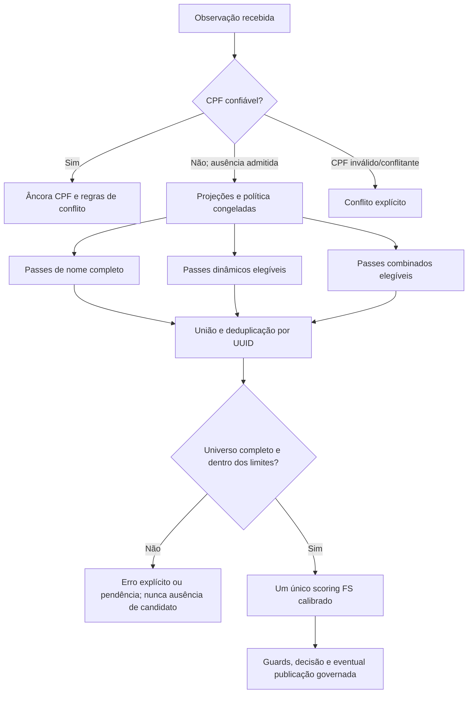

# Decisão arquitetural — blocking complementar com referência IBGE

**Data:** 27/09/2026  
**Estado:** decisão arquitetural aceita; implementação progressiva. **Não** equivale a homologação estatística, autorização institucional nem ativação probabilística.  
**Escopo:** núcleo de identidade, recuperação de candidatos sem CPF confiável, Calibrador, Avaliador, Runner, busca semicega e reprocessamento incremental.  
**Fonte canônica desta decisão:** este documento, subordinado à Especificação Técnica vigente e à [Arquitetura de Identidade e Linkage](Arquitetura_Identidade_Linkage.md). Os planos de experimento descrevem implementação e avaliação, mas não podem reinterpretar a decisão.  
**Compatibilidade:** preserva a [ADR-002](../../Documentos/ADR/ADR-002-calibrador-fs-u-condicionado.md), a [política brasileira de blocking](Linkage_Politica_Blocking_Identidade_Brasil_v1.0.md), a [decisão de escopo IBGE por atributo](Linkage_Bootstrap_U_Municipio_SP_20260926.md) e a separação entre busca de candidatos, scoring e publicação.

## 1. Decisão irrevogável sem revisão formal

**Nome completo, blocking dinâmico e blocking combinado são capacidades COMPLEMENTARES do mesmo sistema de recuperação; não são soluções concorrentes, três motores ou políticas de decisão distintas.** Suas consultas utilizam projeções/índices compartilhados, geram passes rastreáveis, compõem uma **união deduplicada** de candidatos e entregam essa união ao **único** motor probabilístico C# Fellegi–Sunter (FS). Nenhum passe decide identidade, publica associação, funde UUID ou dispensa conflito de CPF. A seleção efetiva dos passes continua congelada em política/modelo versionados e sujeita a gates de ativação.

A hipótese orientadora é concreta: mesmo o núcleo **pessoa MARIA SILVA + mãe MARIA SILVA + nascimento exato**, com prenome e sobrenome individualmente muito frequentes, tende a ser muito mais seletivo que a consulta por qualquer um dos nomes isoladamente. Não se escolhem nomes raros artificialmente para provar a ideia. A complementaridade recupera divergências de grafia e de nascimento sem abandonar a seletividade da interseção inicial. Essa **é a escolha de arquitetura**; a magnitude efetiva de sua seletividade e de seu recall em São Paulo exige mensuração representativa.

A referência pública de nomes do Censo 2022 é a base externa **versionada e verificável** para planejar as projeções, estudar frequências, construir um vocabulário de grafias publicadas, estimar seletividade sob hipóteses declaradas e gerar corpus sintético. Ela **não fornece nomes completos vinculados a mães e dias exatos de nascimento**, nem mede taxas de erro de digitação. A validação de distribuição conjunta, recall e probabilidade real de erro deve vir de evidência adicional.

A rota de CPF estruturalmente válido/confiável continua **determinística e anterior** a todos os passes probabilísticos; CPF informado inválido/conflitante não é convertido silenciosamente em CPF ausente. `initial_uuid` é proveniência, não chave de busca nem evidência.

## 2. Modelo lógico: três capacidades e uma política

| Capacidade complementar | Finalidade | Condições e estado de implementação em 27/09/2026 |
|---|---|---|
| **Nome completo** | Passes de coincidência integral normalizada, aliases históricos e representações permitidas; base simples e muito seletiva quando combinada com nascimento/filiação. | `name_full`/`mother_name_full` e variantes são **features/projeções disponíveis**. Não afirmar que existe um terceiro executor operacional autônomo: seus passes são construídos pelo planejador compartilhado ou pelo ruleset dinâmico. |
| **Dinâmico** | Recuperar casos em que os atributos ou suas representações disponíveis pedem outras combinações: campos ausentes, nome parcial, componentes, fonética e passes complementares. | `BlockingRuleSetSearch`/`BlockingRuleSetCandidatePlanner`: regras de modelo congeladas, selecionadas e versionadas pelo Calibrador, utilizadas pelo Runner. Não inventar regras na hora de cada consulta. |
| **Combinado** | Explorar a interseção nome completo da pessoa + nome completo da mãe + data; adicionar pequenas expansões para erros recorrentes e variantes. | `CombinedIdentityCandidatePlanner` V1 implementado no Core (PR #526), com cinco passes e bootstrap sintético IBGE. Acrescido à **busca síncrona semicega** quando elegível, **não** automaticamente promovido ao Runner em lote nem ao Calibrador. |

“Três capacidades” não significa três índices SQL físicos obrigatórios. O banco mantém uma projeção de chaves versionada e indexável; os **passes lógicos** podem reutilizar o mesmo índice simples com parâmetros diferentes. Índice composto é otimização física posterior, comparada com planos de execução do SQL Server, sem alterar a semântica da busca.

### 2.1 Álgebra obrigatória

Para um passe `P_i` com cláusulas de atributos `a_j`, os valores alternativos de uma mesma cláusula são unidos por OR, os atributos do mesmo passe são intersectados por AND e os diferentes passes são unidos por OR:

```text
P_i = INTERSECT(UNION(valores de nome), UNION(valores de mãe), ...,
                UNION(valores de nascimento))
C = DISTINCT_UUID(UNION(P_nome_completo, P_dinamico, P_combinado))
FS = ScoreModeloCongelado(observação, C)
```

O pipeline **não encerra** após o primeiro candidato nem presume que o primeiro resultado é verdadeiro. Deve registrar a proveniência do(s) passe(s) que recuperou(aram) o candidato, com minimização de PII. A execução pode pular somente passes **inelegíveis** por ausência/invalidade de atributos ou desabilitados pela política congelada, não passes complementares elegíveis por conveniência. A falta do nome da mãe ou da data desativa passes que os exigem; não elimina os passes dinâmicos elegíveis. Paridade entre Calibrador, Avaliador, Runner e busca exige consumir o **mesmo contrato versionado**, sem caminhos semânticos paralelos.

### 2.2 Pipeline de referência



Este diagrama é **alvo arquitetural**. O Runner em lote atualmente usa o ruleset dinâmico; não interpretar o desenho como prova de que a união dos três mecanismos já esteja operacional no lote. O protótipo combinado já é aditivo na busca semicega, que possui gate próprio de finalidade/visibilidade e está desabilitada em ambientes reais até aprovação específica.

## 3. Por que o IBGE melhora a construção do índice

### 3.1 Coleta, tratamento e semântica

A Nota Técnica 01/2025, *Censo Demográfico 2022 — Nomes no Brasil*, registra a orientação de coletar preferencialmente **todos os sobrenomes** e, quando isso não fosse possível, o **último**. A estatística divulgada contabiliza **sobrenomes sem importar sua posição** no nome. Logo, o campo público `SOBRENOME` é uma referência para **ocorrência do sobrenome em qualquer posição**, não uma contagem específica de “último sobrenome”.

**Essa característica é uma VANTAGEM para o blocking invertido por presença de sobrenome:** `SILVA` pode participar da recuperação de `MARIA SILVA`, `MARIA SILVA OLIVEIRA` ou `MARIA OLIVEIRA SILVA`, qualquer que seja sua posição. A interseção com o prenome, a mãe e o nascimento torna a consulta mais seletiva. Não é necessário conhecer a posição do sobrenome para formar e testar a chave **por presença**. O fato de a coleta prever fallback para o último sobrenome, entretanto, significa que a publicação pode não representar exaustivamente os sobrenomes intermediários de todas as pessoas.

A questão posicional **não bloqueia** o uso estatístico do IBGE em um índice por presença de sobrenome. Ela **impede apenas** tomar diretamente `freq_IBGE(SILVA)` como `P(último_token = SILVA)`, ou tratar todo token de um `nome_completo` não estruturado como sobrenome confirmado. Uma projeção `last_name_token` é uma **heurística técnica**, não o campo oficial `SOBRENOME`. Para estimar a seletividade dessa heurística, validar a correspondência semântica ou realizar análise de sensibilidade. Se a fonte fornecer sobrenomes estruturados, usar sua semântica diretamente.

O Censo é uma fonte estatística **tratada**, não uma coleta bruta livre de verificações: preserva distintas grafias divulgáveis e realiza normalizações/tratamentos de publicação. Contagens censitárias não identificam grafias incorretas e não incluem necessariamente todos os nomes raros/suprimidos. Nem frequência não publicada nem ausência da projeção equivalem a frequência zero.

Fonte primária: [IBGE, Nota Técnica 01/2025 — Nomes no Brasil](https://biblioteca.ibge.gov.br/visualizacao/livros/liv102228.pdf). A referência local imutável é `Solution/data/reference/ibge-nomes-2022`, com manifesto e SHA-256 físico/canônico.

### 3.2 Frequência e escopo por atributo

- Para projetar/estudar **prenome da pessoa**, usar marginais censitárias de primeiro nome com semântica e escopo apropriados.
- Para projetar/estudar **sobrenomes por presença**, usar marginais oficiais `SOBRENOME` como sinal estatístico **auxiliar** e testar no corpus a seletividade da projeção concreta. Não converter silenciosamente as marginais em probabilidade de último token nem em frequência de nome completo.
- Para a **mãe**, preservar a escolha técnica atual de bootstrap nominal **Brasil/FEMININO** para prenomes e **Brasil/TODOS** para sobrenomes, devido à diferença geracional/geográfica; isso não é medição da distribuição de mães vinculadas aos cadastros da Jornada.
- Para a **pessoa**, o recorte municipal de São Paulo `3550308` é **V2 candidata**, sujeita à verificação integral das marginais `NOME/TODOS` e `SOBRENOME/TODOS`, cobertura, cauda e impacto. A V1 nacional não pode preencher silenciosamente uma lacuna municipal.
- Período/coorte e sexo só podem ser usados quando o recorte fornecido e a semântica do campo realmente os sustentarem. Conservar fonte, versão, hash, parser, recorte e massa publicada/ausente em todas as estimativas.

O IBGE serve para **pré-calcular diagnósticos, planejar índices e inicializar estimativas declaradas**. O `u` nominal **não condicionado** do bootstrap IBGE não é o `u` operacional **condicionado à união dos passes de blocking**. Conforme ADR-002, o alvo de calibração de `u` é o universo efetivo dos candidatos deduplicados, com suporte observado por passe e transição governada do bootstrap para a estimação empírica. `m` requer pares rotulados de vínculos verdadeiros. Não presumir independência entre atributos para calibrar o scorer.

### 3.3 Catálogo de grafias e vizinhanças: evolução decidida

Construir, como **evolução a implementar**, um catálogo de grafias **efetivamente divulgadas** pelo IBGE com forma publicada, forma normalizada, frequência, tipo estatístico, período/localidade quando presentes e hash da origem. Derivar separadamente relações de vizinhança por algoritmo/versão (distância ortográfica, inserção/remoção, fonética PT-BR etc.). Por exemplo, `ANA/ANNA`, `LUIS/LUIZ` e `IAN/YAN` são **variantes possíveis de busca**, não erros comprovados nem pares automaticamente equivalentes.

Não confundir:
1. grafia publicada e sua frequência (fato censitário agregado);
2. relação calculada entre duas grafias (hipótese técnica de vizinhança);
3. probabilidade de erro ou equivalência entre duas observações (exige dados próprios rotulados).

O catálogo pode ampliar as alternativas de um atributo nos passes indexados. Usar frequência/similaridade para ordenar planejamento e medir custo, **sem truncar silenciosamente grafias raras, impedir recall ou contaminar `m/u`**. Novas versões exigem fingerprints e comparação contra o ruleset vigente. A fonética V1 **já implementada** não equivale a catálogo censitário completo; não afirmar que este último já está no runtime.

## 4. Caso de estresse MARIA SILVA × MARIA SILVA × nascimento

O caso deliberadamente reúne prenome e sobrenome muito comuns da pessoa e da mãe. **Não é uma identidade real, um exemplo de pessoa do Censo nem prova de que a sequência “MARIA SILVA” seja o nome completo mais frequente no Brasil.** É um cenário de estresse reproduzível para a arquitetura:

```text
Nome da pessoa: MARIA SILVA
Nome da mãe:    MARIA SILVA
Nascimento:     11/02/1975 (data meramente ilustrativa)
Passe exato:    name_full ∩ mother_name_full ∩ birth_year ∩ birth_month ∩ birth_day
```

Índice por presença: `nome_first=MARIA` + token/sobrenome observado `SILVA` pode ser combinado com `mother_name_first=MARIA` + `SILVA` e a data, usando cada marginal censitária apenas segundo sua semântica. Para nomes completos e filiação, há dependência familiar: mães e filhos podem compartilhar sobrenomes, e a distribuição da mãe não é a de todas as pessoas do município. O Calibrador **deve medir**, não assumir, a cardinalidade resultante.

### 4.1 Memória matemática correta para a estimativa histórica

A discussão que originou o protótipo registrou o valor **ilustrativo de uma chance em 599 milhões** para a coincidência da combinação específica no modelo de marginais e, com `N≈11.500.000`, aproximadamente **0,019 outras pessoas esperadas** com essa mesma combinação. A documentação anterior do PR #526 não conservou as frequências numéricas individuais nem o código original do cálculo; **não inventar tais entradas nem certificar o número como estatística medida pelo IBGE**.

Se, para uma combinação fixa `x`, `p(x)=1/599.000.000` se aplicar à população consultada, o número de *outras pessoas* entre `N-1` residentes que teriam `x` possui expectativa:

```text
E[outras pessoas com x | uma pessoa com x] = (N - 1) × p(x)
Para N = 11.500.000, E ≈ 0,0192.
```

Isso **não é** o número esperado de **todas** as colisões entre todos os pares de São Paulo, não é probabilidade de falso vínculo entre candidatos pré-selecionados, não é prova de unicidade e não é um SLA. Sob o modelo simplificado de pessoas independentes e chaves conjuntas `x`, a expectativa de **pares totais** seria `C(N,2) × Σ_x p(x)^2`, exigindo a **distribuição conjunta completa**. Para uma chave frequente de mãe/filho, multiplicar marginais independentes pode subestimar colisões; o efeito deve ser medido/limitado por cenários de dependência.

**Decisão:** preservar 1/599 milhões como **cenário matemático ilustrativo de estresse**, não como taxa nacional validada, “pior caso observado” nem justificativa para baixar guards. Manter a fórmula e seus denominadores aqui; uma reconstituição numérica das marginais exatas é **pendência documental explícita**, sem bloquear o experimento do índice.

### 4.2 O que efetivamente valida a tese

Separar as evidências:
- **Censitária:** contagens marginais, frequência/ordem de grafias, coortes/recortes e cobertura da projeção publicada;
- **Modelo matemático:** distribuição conjunta hipotética explícita, dependência mãe/filho, distribuição de nascimento e cenários de cauda;
- **Corpus sintético:** reprodução de hipóteses e erros controlados, sem certificação populacional;
- **Gold ancorada por CPF:** auditoria agregada e *read-only* da tripla normalizada pessoa+mãe+nascimento, com denominador, cobertura de projeção, unicidade de pessoa e seleção amostral;
- **Validação representativa independente:** recall dos pares verdadeiros e taxa de falsos vínculos, abstenções, homônimos e erros por estrato, sob os gates institucionais.

A auditoria `local-linkage-triplet-collision-audit.ps1` já conta agregados da tripla na Gold ancorada; ela **não** é, por si, uma amostra aleatória da população municipal.

## 5. Nascimento: chaves pequenas e erros classificados

O índice não precisa de uma coluna ou índice físico por tipo de erro. Gerar, na aplicação, **alternativas de data civilmente válidas**, consultar as mesmas projeções indexadas e deduplicar UUIDs. Em cada passe, manter nome e filiação suficientemente seletivos; os dados ausentes desabilitam somente os passes dependentes deles. Não transformar data não informada em aniversário fictício.

| Classe | Exemplo a partir de 11/02/1975 | Papel |
|---|---|---|
| Exata | 11/02/1975 | Passe combinado V1 já implementado |
| Dia/mês invertidos | 02/11/1975 | Passe combinado V1, somente quando troca resulta em data válida e diferente |
| Ano adjacente | 11/02/1974 e 11/02/1976 | Passe V1, validando dia/mês no ano resultante (inclusive 29/02) |
| Século deslocado | 11/02/1875 ou 11/02/2075, se plausível | Estado de **comparação** V5; passe de recuperação **não** integrado ao combinado V1 |
| Um ou dois dígitos divergentes | Datas civilmente válidas conforme o comparador | Estados de **comparação** V5; política de expansão depende de prova de ganho marginal |
| Ano/dia convencional, data aproximada ou ausente | Não inferir datas inventadas | Rota governada complementar, com estratos e guards específicos |

A inversão de **dígitos do ano** (1975↔1957), a inversão **dia/mês** e o deslocamento **de século** são três erros distintos, não intercambiáveis. Limites de calendário tornam algumas trocas impossíveis, mas não autorizam presumir que erros do dia ou data imputada sejam inexistentes. O comparador `BirthDateSemanticEvidence` V5 já classifica sete estados: `EXACT`, `DAY_MONTH_SWAP`, `CENTURY_SHIFT`, `ONE_DIGIT_ERROR`, `TWO_DIGIT_ERROR`, `PARTIAL_COMPONENT_AGREEMENT` e `OTHER_DISAGREEMENT`. **O estado reconhecido pelo scorer não implica que o blocking alcançou o par**.

Os passes adicionais de data exigem teste de recall incremental, tamanho de bloco, validade civil, distribuição real de erros (inclusive datas 1 e 15, anos aproximados, erro simultâneo de nome/mãe/data) e custo de índice. Não criar uma consulta irrestrita para “capturar todos os erros” nem impor que apenas três datas alternativas sejam possíveis.

## 6. Estado real da implementação e fronteiras de ativação

| Componente | Estado constatado na base de 27/09/2026 | Pendência |
|---|---|---|
| Projeções `name_full`, `mother_name_full`, fonéticas, componentes de nascimento e `identidade.blocking_chave` | Implementadas; projeção corrente e aliases de nome | Testar novo catálogo censitário antes de introduzi-lo |
| Ruleset dinâmico | Calibrador escolhe/congela política; Runner em lote usa `BlockingRuleSetCandidatePlanner` | Preservar paridade com avaliação da **união** quando combinado for promovido |
| `CombinedIdentityCandidatePlanner` `COMBINED_IDENTITY_CANDIDATES_V1` | Cinco passes (exato; dia/mês; ano ±1; fonética pessoa; fonética mãe); incluído no Core no PR #526 | Integrar de modo versionado e governado ao Calibrador/Runner após métricas/gates |
| Bootstrap sintético combinado com IBGE | Teste reproduzível com 120 pessoas, seed 526 e hash de snapshot, compara exato vs união | Não representa homologação de recall municipal nem a distribuição conjunta real |
| Busca semicega síncrona | União aditiva dinâmico+combinado quando elegível; seleção interna usa FS; apresentação neutra | Gate de finalidade/visibilidade: desabilitada para dados reais sem aprovação explícita (PR #544 / issue #539) |
| Estimativa IBGE municipal SP para pessoa | V2 **candidata**; mãe nacional V1 é decisão vigente | Leitura integral/diagnóstico e avaliação V1 vs V2 antes de promoção |

**A decisão arquitetural não habilita código automaticamente.** Não apagar o dinâmico, alterar parâmetros do FS, mudar a âncora CPF, introduzir fallback geográfico tácito ou considerar teste sintético como aprovação.

## 7. Reprocessamento incremental: dependências do índice

Quando nova Pessoa entra na Gold ou uma referência muda, um linkage apenas orientado a observações novas deixa de reavaliar observações antigas potencialmente afetadas. O sistema deve manter/reconstruir a relação **referência ↔ passes/chaves ↔ observações candidatas**, incluindo as três capacidades e suas versões.

Para cada alteração relevante, calcular dependências de **chaves antigas e novas** (nome/aliases, mãe, nascimento, projeção/algoritmo e snapshot aplicável), identificar e deduplicar observações afetadas **inclusive anteriormente RESOLVIDAS**, além das pendentes. Congelar um run com conjunto de afetados e versão do modelo; persistir a fila para atravessar timeout, limites de lote, retries e falha parcial. Uma mudança de política, normalizador, comparador ou projeção pode exigir reprocessamento mais amplo que um delta local.

Não confundir recomputação de evidência com publicação: o resultado bruto por run é preservado e o ledger DT-05 só emite transição quando a **assinatura semântica V1** mudar. Mudança isolada de score, sem mudança dos campos assinados, não gera transição nova. Nenhuma combinação de passes deve revogar associação existente por truncamento, timeout ou universo parcial.

## 8. Aceite experimental, operacional e institucional: gates separados

### 8.1 Gates técnicos e estatísticos do Calibrador

1. Congelar manifesto de referência IBGE (arquivo, hash físico/canônico, parser, recorte, marginais, massa publicada/ausente), catálogo/projeção/normalizador e modelo/ruleset.
2. Documentar as frequências efetivamente usadas no caso MARIA SILVA + MARIA SILVA + nascimento e reconstituir o valor ilustrativo de 599 milhões **somente se as entradas históricas forem recuperadas**; caso contrário, reproduzir nova estimativa nomeada e versionada, sem atribuí-la retroativamente à discussão original.
3. Ensaiar o caso de nomes frequentes, nomes raros e homônimos completos, com dependência familiar e coortes plausíveis; não otimizar somente a situação de nomes raros.
4. Para cada capacidade/passe e sua **união**: medir recall sobre pares verdadeiros, cobertura sob ausência da mãe/nascimento, candidatos exclusivos, sobreposição, FP de recuperação (não confundir com falso vínculo), custo e concentração dos maiores blocos.
5. Cruzar **todos os sete estados V5** de data com erros isolados e simultâneos nos dois nomes; medir o ganho marginal das expansões e se o scorer é acionado para o par verdadeiro.
6. Medir P50/P95/P99, I/O, CPU, memória, índices e `EXPLAIN`/planos SQL Server em escala realista. Comparar índices simples versus compostos **somente para passes finalistas**; SQL Server continua runtime relacional operacional.
7. Ensaiar pelo menos múltiplas ondas: entrada de CPF tardio, melhoria de nomes/datas, mudança de referência/aliases, reprocessamento de RESOLVIDOS afetados, deduplicação de fila e idempotência do ledger.
8. Testar fail-closed: excesso de candidatos não vira `TOP N` silencioso, ausência de dado não vira evidência fabricada, source OOV não vira `u=0`, homônimo total não vira associação automática e conflito CPF não é rebaixado.
9. Separar TRAIN/VALIDATION/TEST, baseline congelada e avaliação independente representativa por estratos (incluindo sem CPF e sem mãe). O Calibrador pode **propor** promoção; apenas a governança apropriada decide ativação.

### 8.2 Distinção de gates

- **Protótipo e documentação:** autorizados para estudo e ensaios isolados.
- **Promoção de passes ao Runner/Calibrador:** requer implementação compartilhada, versionamento, paridade, regressão de cobertura/custo e decisão formal.
- **Ativação em dados reais/HML/Produção:** requer corpus representativo, avaliação independente, controle de finalidade/visibilidade da busca, política de decisão aprovada e gates institucionais. Nenhum número matemático ou CI verde isoladamente satisfaz esses requisitos.

## 9. Critérios de não regressão e rastreabilidade

1. **Arquitetura:** complementares e aditivos, um universo deduplicado e um motor FS. Não introduzir motores concorrentes de identidade.
2. **Estatística:** IBGE marginal e `u` condicionado ao blocking distintos; presença de sobrenome é utilizável, posição não deve ser inventada; mãe/filho e coortes não presumidos independentes.
3. **Nascimento:** chaves válidas, passes V1 explicitados, V5 do scoring distinto da recuperação.
4. **Segurança:** CPF/UUID/PII não expostos em índices estatísticos ou logs de avaliação; limites/timeout falham fechados, sem busca irrestrita nem publicação incompleta.
5. **Replay:** alterações de fonte, normalizador, catálogo, passes e regras exigem versões e fingerprints; mesmo contrato do Calibrador ao Runner.
6. **Trilha 4:** dependências old+new, reavaliar inclusive RESOLVIDOS, persistir fila, preservar DT-05.
7. **Governança:** distinguir hipótese matemática, observação censitária, teste sintético, auditoria Gold e validação institucional.

Mudança que contrarie qualquer uma dessas sete invariantes requer revisão explícita deste documento, dos dois documentos de blocking e dos contratos/testes correlatos **no mesmo change-set**. Não reabrir por interpretação informal o princípio de complementaridade.

## 10. Fontes e documentos subordinados

- [IBGE — Nota Técnica 01/2025, Nomes no Brasil](https://biblioteca.ibge.gov.br/visualizacao/livros/liv102228.pdf): coleta, tratamento, primeiros nomes e sobrenomes sem posição.
- [Snapshot censitário local e manifesto](../data/reference/ibge-nomes-2022/projection-manifest.json): fonte imutável `CENSO2022_NOMES_BRASIL_V1`.
- [Arquitetura de Identidade e Linkage](Arquitetura_Identidade_Linkage.md), [Política Brasil](Linkage_Politica_Blocking_Identidade_Brasil_v1.0.md), [Blocking Dinâmico](Linkage_Dynamic_Blocking.md), [Plano do Calibrador](Calibrador_Plano_Blocking_Analise.md).
- [ADR-002, FS e `u` condicionado](../../Documentos/ADR/ADR-002-calibrador-fs-u-condicionado.md), [Decisões IBGE por atributo](Linkage_Bootstrap_U_Municipio_SP_20260926.md), [DT-05](DT05_Assinatura_Semantica_V1.md), [Plano de Desenvolvimento](Plano_Desenvolvimento.md).
- [PR #526](https://github.com/lucianox777/Jornada/pull/526), [PR #532](https://github.com/lucianox777/Jornada/pull/532), [PR #544](https://github.com/lucianox777/Jornada/pull/544), [issue #31](https://github.com/lucianox777/Jornada/issues/31), [issue #539](https://github.com/lucianox777/Jornada/issues/539).
