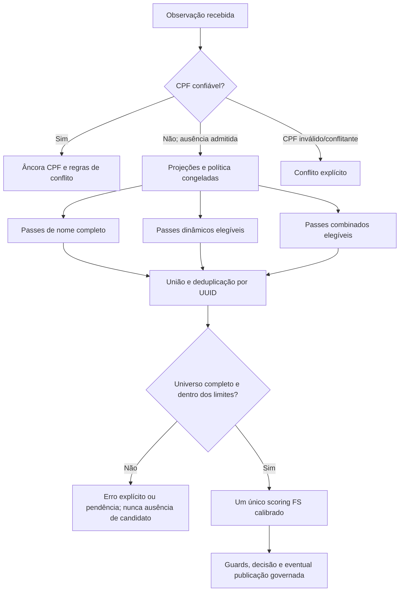

# Decisão arquitetural — blocking complementar com referência IBGE

**Data:** 27/09/2026  
**Estado:** decisão arquitetural aceita; implementação progressiva. **Não** equivale a homologação estatística, autorização institucional nem ativação probabilística.  
**Escopo:** núcleo de identidade, recuperação de candidatos sem CPF confiável, Calibrador, Avaliador, Runner, busca semicega e reprocessamento incremental.  
**Fonte canônica desta decisão:** este documento, subordinado à Especificação Técnica vigente e à [Arquitetura de Identidade e Linkage](Arquitetura_Identidade_Linkage.md). Os planos de experimento descrevem implementação e avaliação, mas não podem reinterpretar a decisão.  
**Compatibilidade:** preserva a [ADR-002](../../Documentos/ADR/ADR-002-calibrador-fs-u-condicionado.md), a [política brasileira de blocking](Linkage_Politica_Blocking_Identidade_Brasil_v1.0.md), a [decisão de escopo IBGE por atributo](Linkage_Bootstrap_U_Municipio_SP_20260926.md) e a separação entre busca de candidatos, scoring e publicação.

## 1. Decisão irrevogável sem revisão formal

**Nome completo, blocking dinâmico e blocking combinado são capacidades COMPLEMENTARES do mesmo sistema de recuperação; não são soluções concorrentes, três motores ou políticas de decisão distintas.** Suas consultas utilizam projeções/índices compartilhados, geram passes rastreáveis, compõem uma **união deduplicada** de candidatos e entregam essa união ao **único** motor probabilístico C# Fellegi–Sunter (FS). Nenhum passe decide identidade, publica associação, funde UUID ou dispensa conflito de CPF. A seleção efetiva dos passes continua congelada em política/modelo versionados e sujeita a gates de ativação.

A hipótese orientadora é concreta: mesmo o núcleo **pessoa MARIA SILVA + mãe MARIA SILVA + nascimento exato**, com prenome e sobrenome individualmente muito frequentes, tende a ser muito mais seletivo que a consulta por qualquer um dos nomes isoladamente. Não se escolhem nomes raros artificialmente para provar a ideia. A complementaridade recupera divergências de grafia e de nascimento sem abandonar a seletividade da interseção inicial. Essa **é a escolha de arquitetura**; a magnitude efetiva de sua seletividade e de seu recall em São Paulo exige mensuração representativa.

A referência pública de nomes do Censo 2022 é a base externa **versionada e verificável** para planejar as projeções, estudar frequências, construir um vocabulário de grafias publicadas, estimar seletividade sob hipóteses declaradas e gerar corpus sintético. Ela **não fornece nomes completos vinculados a mães e dias exatos de nascimento**, nem mede taxas de erro de digitação. A validação de distribuição conjunta, recall e probabilidade real de erro deve vir de evidência adicional.

A rota de CPF estruturalmente válido/confiável continua **determinística e anterior** a todos os passes probabilísticos; CPF informado inválido/conflitante não é convertido silenciosamente em CPF ausente. `initial_uuid` é proveniência, não chave de busca nem evidência.

## 2. Modelo lógico: três capacidades e uma política

| Capacidade complementar | Finalidade | Condições e estado de implementação em 27/09/2026 |
|---|---|---|
| **Nome completo** | Passes de coincidência integral normalizada, aliases históricos e representações permitidas; base simples e muito seletiva quando combinada com nascimento/filiação. | `name_full`/`mother_name_full` e variantes são **features/projeções disponíveis**. Não afirmar que existe um terceiro executor operacional autônomo: seus passes são construídos pelo planejador compartilhado ou pelo ruleset dinâmico. |
| **Dinâmico** | Recuperar casos em que os atributos ou suas representações disponíveis pedem outras combinações: campos ausentes, nome parcial, componentes, fonética e passes complementares. | `BlockingRuleSetSearch`/`BlockingRuleSetCandidatePlanner`: regras de modelo congeladas, selecionadas e versionadas pelo Calibrador, utilizadas pelo Runner. Não inventar regras na hora de cada consulta. |
| **Combinado** | Explorar a interseção nome completo da pessoa + nome completo da mãe + data; adicionar pequenas expansões para erros recorrentes e variantes. | `CombinedIdentityCandidatePlanner` V1 implementado no Core (PR #526), com cinco passes e bootstrap sintético IBGE. Acrescido à **busca síncrona semicega** quando elegível, **não** automaticamente promovido ao Runner em lote nem ao Calibrador. |

“Três capacidades” não significa três índices SQL físicos obrigatórios. O banco mantém uma projeção de chaves versionada e indexável; os **passes lógicos** podem reutilizar o mesmo índice simples com parâmetros diferentes. Índice composto é otimização física posterior, comparada com planos de execução do SQL Server, sem alterar a semântica da busca.

### 2.1 Álgebra obrigatória

Para um passe `P_i` com cláusulas de atributos `a_j`, os valores alternativos de uma mesma cláusula são unidos por OR, os atributos do mesmo passe são intersectados por AND e os diferentes passes são unidos por OR:

```text
P_i = INTERSECT(UNION(valores de nome), UNION(valores de mãe), ...,
                UNION(valores de nascimento))
C = DISTINCT_UUID(UNION(P_nome_completo, P_dinamico, P_combinado))
FS = ScoreModeloCongelado(observação, C)
```

O pipeline **não encerra** após o primeiro candidato nem presume que o primeiro resultado é verdadeiro. Deve registrar a proveniência do(s) passe(s) que recuperou(aram) o candidato, com minimização de PII. A execução pode pular somente passes **inelegíveis** por ausência/invalidade de atributos ou desabilitados pela política congelada, não passes complementares elegíveis por conveniência. A falta do nome da mãe ou da data desativa passes que os exigem; não elimina os passes dinâmicos elegíveis. Paridade entre Calibrador, Avaliador, Runner e busca exige consumir o **mesmo contrato versionado**, sem caminhos semânticos paralelos.

### 2.2 Pipeline de referência



Este diagrama é **alvo arquitetural**. O Runner em lote atualmente usa o ruleset dinâmico; não interpretar o desenho como prova de que a união dos três mecanismos já esteja operacional no lote. O protótipo combinado já é aditivo na busca semicega, que possui gate próprio de finalidade/visibilidade e está desabilitada em ambientes reais até aprovação específica.

## 3. Por que o IBGE melhora a construção do índice

### 3.1 Coleta, tratamento e semântica

A Nota Técnica 01/2025, *Censo Demográfico 2022 — Nomes no Brasil*, registra a orientação de coletar preferencialmente **todos os sobrenomes** e, quando isso não fosse possível, o **último**. A estatística divulgada contabiliza **sobrenomes sem importar sua posição** no nome. Logo, o campo público `SOBRENOME` é uma referência para **ocorrência do sobrenome em qualquer posição**, não uma contagem específica de “último sobrenome”.

**Essa característica é uma VANTAGEM para o blocking invertido por presença de sobrenome:** `SILVA` pode participar da recuperação de `MARIA SILVA`, `MARIA SILVA OLIVEIRA` ou `MARIA OLIVEIRA SILVA`, qualquer que seja sua posição. A interseção com o prenome, a mãe e o nascimento torna a consulta mais seletiva. Não é necessário conhecer a posição do sobrenome para formar e testar a chave **por presença**. O fato de a coleta prever fallback para o último sobrenome, entretanto, significa que a publicação pode não representar exaustivamente os sobrenomes intermediários de todas as pessoas.

A questão posicional **não bloqueia** o uso estatístico do IBGE em um índice por presença de sobrenome. Ela **impede apenas** tomar diretamente `freq_IBGE(SILVA)` como `P(último_token = SILVA)`, ou tratar todo token de um `nome_completo` não estruturado como sobrenome confirmado. Uma projeção `last_name_token` é uma **heurística técnica**, não o campo oficial `SOBRENOME`. Para estimar a seletividade dessa heurística, validar a correspondência semântica ou realizar análise de sensibilidade. Se a fonte fornecer sobrenomes estruturados, usar sua semântica diretamente.

O Censo é uma fonte estatística **tratada**, não uma coleta bruta livre de verificações: preserva distintas grafias divulgáveis e realiza normalizações/tratamentos de publicação. Contagens censitárias não identificam grafias incorretas e não incluem necessariamente todos os nomes raros/suprimidos. Nem frequência não publicada nem ausência da projeção equivalem a frequência zero.

Fonte primária: [IBGE, Nota Técnica 01/2025 — Nomes no Brasil](https://biblioteca.ibge.gov.br/visualizacao/livros/liv102228.pdf). A referência local imutável é `Solution/data/reference/ibge-nomes-2022`, com manifesto e SHA-256 físico/canônico.

### 3.2 Frequência e escopo por atributo

- Para projetar/estudar **prenome da pessoa**, usar marginais censitárias de primeiro nome com semântica e escopo apropriados.
- Para projetar/estudar **sobrenomes por presença**, usar marginais oficiais `SOBRENOME` como sinal estatístico **auxiliar** e testar no corpus a seletividade da projeção concreta. Não converter silenciosamente as marginais em probabilidade de último token nem em frequência de nome completo.
- Para a **mãe**, preservar a escolha técnica atual de bootstrap nominal **Brasil/FEMININO** para prenomes e **Brasil/TODOS** para sobrenomes, devido à diferença geracional/geográfica; isso não é medição da distribuição de mães vinculadas aos cadastros da Jornada.
- Para a **pessoa**, o recorte municipal de São Paulo `3550308` é **V2 candidata**, sujeita à verificação integral das marginais `NOME/TODOS` e `SOBRENOME/TODOS`, cobertura, cauda e impacto. A V1 nacional não pode preencher silenciosamente uma lacuna municipal.
- Período/coorte e sexo só podem ser usados quando o recorte fornecido e a semântica do campo realmente os sustentarem. Conservar fonte, versão, hash, parser, recorte e massa publicada/ausente em todas as estimativas.

O IBGE serve para **pré-calcular diagnósticos, planejar índices e inicializar estimativas declaradas**. O `u` nominal **não condicionado** do bootstrap IBGE não é o `u` operacional **condicionado à união dos passes de blocking**. Conforme ADR-002, o alvo de calibração de `u` é o universo efetivo dos candidatos deduplicados, com suporte observado por passe e transição governada do bootstrap para a estimação empírica. `m` requer pares rotulados de vínculos verdadeiros. Não presumir independência entre atributos para calibrar o scorer.

### 3.3 Catálogo de grafias e vizinhanças: evolução decidida

Construir, como **evolução a implementar**, um catálogo de grafias **efetivamente divulgadas** pelo IBGE com forma publicada, forma normalizada, frequência, tipo estatístico, período/localidade quando presentes e hash da origem. Derivar separadamente relações de vizinhança por algoritmo/versão (distância ortográfica, inserção/remoção, fonética PT-BR etc.). Por exemplo, `ANA/ANNA`, `LUIS/LUIZ` e `IAN/YAN` são **variantes possíveis de busca**, não erros comprovados nem pares automaticamente equivalentes.

Não confundir:
1. grafia publicada e sua frequência (fato censitário agregado);
2. relação calculada entre duas grafias (hipótese técnica de vizinhança);
3. probabilidade de erro ou equivalência entre duas observações (exige dados próprios rotulados).

O catálogo pode ampliar as alternativas de um atributo nos passes indexados. Usar frequência/similaridade para ordenar planejamento e medir custo, **sem truncar silenciosamente grafias raras, impedir recall ou contaminar `m/u`**. Novas versões exigem fingerprints e comparação contra o ruleset vigente. A fonética V1 **já implementada** não equivale a catálogo censitário completo; não afirmar que este último já está no runtime.

### 3.4. Registro censitário completo versus publicação agregada: índices por presença e último sobrenome

**Conferência metodológica oficial, 27/09/2026:** a Nota Técnica IBGE 01/2025, *Nomes no Brasil*, p. 1, confirma **dois campos na coleta**: (i) primeiro nome ou nome composto; (ii) todos os outros sobrenomes, com instrução de preservar preferencialmente o conjunto completo e usar **o último sobrenome se não fosse possível**. A publicação usa somente o **primeiro prenome** do campo de nomes e calcula a frequência de **cada sobrenome independente da posição**. O Censo possui o conjunto de campos **coletados**, mas a publicação estatística aberta **não oferece** registros individuais completos nem a combinação individual pessoa+mãe+nascimento.

Exemplo **fictício** `MARIA DA SILVA SOUZA`:
- entrada ilustrativa na coleta: campo de nome `MARIA`; campo de sobrenomes `DA SILVA SOUZA`;
- frequência publicada: a pessoa pode contribuir para a categoria `MARIA` e para **duas categorias distintas de sobrenome**, `SILVA` e `SOUZA`, conforme as regras oficiais de normalização/partículas. A pessoa **não** é duplicada no denominador populacional;
- chaves técnicas **complementares** da Jornada: `name_full=MARIA DA SILVA SOUZA`, `name_first=MARIA`, `surname_any={SILVA,SOUZA}` e `last_name_token=SOUZA`; produzir as equivalentes maternas quando presentes. `surname_any` é uma proposta de feature técnica por tokens confiavelmente extraídos/avaliados; ela **não** declara que qualquer token após o primeiro seja, por definição, um sobrenome civil;
- o último sobrenome merece **passe específico**: tanto a coleta completa quanto o fallback descrito pelo IBGE buscam reter o último sobrenome, de modo que o último token lexical válido constitui hipótese **testável** de cluster por último sobrenome. A cobertura e os erros dessa proxy devem ser medidos, com tratamento de partículas, agnomes (JÚNIOR/FILHO/NETO), hífens e nomes compostos;
- a estatística `freq_IBGE(SILVA)` é válida **para presença em qualquer posição divulgada**. Ela pode ordenar/planejar passes por presença e sinalizar blocos frequentes, mas **não** deve ser transformada automaticamente em `P(last_name_token=SILVA)`. Isso não invalida nem desativa o passe de último sobrenome.

**Prioridade do desenho:** recuperar o candidato verdadeiro com o menor universo possível, **não** declarar a inexistência de colisões. O caso de estresse de nomes frequentes testa a seletividade de **múltiplas interseções**; um nome comum isolado não é índice seletivo. Bloqueios nome+pessoa/mãe+nascimento podem ter altíssima redução por construção, mas a eficácia real é verificada por recall e cardinalidade da **união**, inclusive nomes comuns, variantes legítimas e ausência de mãe.

**Distinção que não deve voltar a ser confundida:** para `MARIA DA SILVA SOUZA`, as duas contribuições `SILVA` e `SOUZA` são **contagens em duas classes de sobrenome distintas**; não são duas Pessoas, nem uma publicação de dois campos individuais com o nome completo recuperável. A forma `SOUSA` **não** substitui automaticamente `SOUZA` na fonte: se ambas forem publicadas, suas contagens originais permanecem separadas, com eventuais vínculos de fonética/vizinhança em uma **tabela técnica distinta, versionada**. A partícula `DA` segue a normalização documentada e não vira sobrenome afirmado. A frequência de presença `SILVA` é útil como *prior de cardinalidade*, inclusive para um passe por último sobrenome, desde que o erro de aproximação posicional seja registrado e medido na Gold; a escolha final do índice físico se baseia no plano real do SQL Server, não em alegada equivalência posicional entre as duas frequências.

**Regra para o núcleo:** não descartar o passe de último sobrenome alegando que o IBGE publicou sobrenomes sem posição. Justamente porque o IBGE solicitou o conjunto e previu como fallback o **último**, essa feature gera um agrupamento potencialmente útil e mensurável; a cautela estatística se restringe a não declarar que a marginal por ocorrência em qualquer posição seja `P(último_token)` observada.

**Variante nominal e fonética:** preservar grafias publicadas separadamente, mapear vizinhanças calculadas (por exemplo, `SOUZA/SOUSA`; `LUIS/LUIZ`, quando presentes no snapshot e compatíveis com o atributo) e utilizar fonética brasileira versionada como **passes alternativos**, nunca como equivalência determinística da pessoa. Avaliar passes `full_name`, `first_name+surname_any`, `first_name+last_name_token`, equivalentes maternos, fonética integral e vizinhança ortográfica, isolados e em interseção com componentes de nascimento. Favorecer variantes com frequência conhecida na modelagem de custo sem suprimir a cauda, truncar silenciosamente candidatos ou interpretar grafia alternativa como erro.

**Fontes:** [IBGE, Nota Técnica 01/2025, p. 1](https://biblioteca.ibge.gov.br/visualizacao/livros/liv102228.pdf); [IBGE, Nomes no Brasil, divulgação 2025](https://www.ibge.gov.br/comunicados/44653-ibge-divulgara-em-4-de-novembro-de-2025-censo-demografico-2022-nomes-no-brasil). Não reutilizar a metodologia de coleta de **2010** (que exigia primeiro e último nomes inicialmente) como se descrevesse a instrução ampliada de sobrenomes de **2022**.

### 3.5. Recortes demográficos e distribuição etária: pessoa SP, mãe Brasil

**Decisão de modelagem do experimento (não alteração do bootstrap FS atual):**
1. **Pessoa:** estudar a distribuição de prenomes e a presença de sobrenomes no **município de São Paulo, IBGE 3550308**, sobre todas as marginais municipais publicadas. Essa V2 municipal **ainda é candidata**, distinta do bootstrap nacional V1 e dependente de cobertura/cauda/snapshot/hash e validação sem fallback geográfico silencioso.
2. **Mãe:** manter a referência de prenome **Brasil/FEMININO** e sobrenomes **Brasil/TODOS** já decidida. Não utilizar automaticamente a distribuição de mulheres jovens de SP como distribuição das mães: diferentes gerações e migração importam; sexo cadastral da pessoa não determina nome/sexo materno além da semântica estatística escolhida.
3. **Coorte etária da pessoa:** onde o produto IBGE publicar prenomes por **década de nascimento**, usar a frequência de `MARIA` por **coorte compatível com a data observada**, e estudar separadamente distribuição de idade da população municipal via fontes oficiais compatíveis. **Verificar se município × década × sexo é uma tabela conjunta de fato disponível**; marginais separadas não autorizam afirmar essa interseção como frequência observada.
4. **Coorte da mãe:** o nascimento da mãe em geral **não é informado no núcleo cadastral**. Não fabricar sua década de nascimento a partir da pessoa nem impor diferença etária fixa mãe/filho; se uma distribuição geracional for usada para simular nomes maternos, tratá-la como **modelo sintético versionado com sensibilidade**, jamais estatística real das mães vinculadas.
5. **Mudança temporal:** o cadastro da Jornada evolui depois de 01/08/2022, data de referência censitária. Crianças nascidas em 2023–2026 e nomes novos **não podiam aparecer** na lista censitária de moradores em 2022. Sua ausência na tabela publicada é **fora de cobertura temporal**, não nome inexistente, frequência zero, data impossível ou critério para descartar a observação. O recorte `2020–2029` da publicação de 2022 abrange apenas nascimentos **até a data de referência** e não representa a década completa.
6. **Volumetria:** em 2022, o IBGE registra **11.451.999 residentes no município**; a estimativa 2026 é **11.911.337**. Para custo físico do índice usar **N de Pessoas REFERENCIA realmente indexadas**, multiplicidade de aliases e distribuição de chaves Gold, **não** assumir que toda a população municipal está na Jornada. Registrar data/denominador de cada extrapolação.

**Janela etária da população viva ≠ retenção histórica:** para o **índice prioritário de atendimento a pessoas presumivelmente vivas**, usar o histograma de idades da população municipal do Censo 2022, trazido explicitamente à data de referência do run ou complementado por fonte demográfica mais recente. Como *controle de plausibilidade*, pode-se utilizar idade máxima **documentada e datada** de pessoa viva no Brasil; esse valor é referência dinâmica e não se deve inventar seu número nem pressupor que um registro civil extraordinário não possa ultrapassá-lo. Um nascimento com idade extrema recebe flag de qualidade, rota de verificação e eventual prioridade baixa, **não exclusão/eliminação automática**. Registros históricos de cidadãos que já faleceram exigem janela própria, sem usar a idade da pessoa viva mais velha como limite. A distribuição etária otimiza **seletividade, prioridade de passes e planejamento de índices**, mas não altera por conta própria a identidade nem encerra passes elegíveis.

**Proibição de filtro rígido por década de nomes:** nem a mais recente nem a mais antiga década divulgada pelo IBGE delimita nascimento civilmente admissível: o Censo retrata residentes em 2022, não nascimentos futuros, e inclui supressão/cauda. Para observações correntes, data posterior à **data civil congelada do run** é impossível e gera inconsistência explícita sem busca probabilística pelo valor inventado; para replays históricos, usar a data de corte histórica congelada. Não converter valores suspeitos em data falsa, descartar registros históricos nem usar ausência no Censo como evidência negativa.

**Fonte demográfica:** [IBGE, São Paulo (3550308), população Censo 2022 e estimativa 2026](https://www.ibge.gov.br/cidades-e-estados/sp/sao-paulo.html); [IBGE, Nomes no Brasil — Nota 01/2025](https://biblioteca.ibge.gov.br/visualizacao/livros/liv102228.pdf).

## 4. Caso de estresse MARIA SILVA × MARIA SILVA × nascimento

O caso deliberadamente reúne prenome e sobrenome muito comuns da pessoa e da mãe. **Não é uma identidade real, um exemplo de pessoa do Censo nem prova de que a sequência “MARIA SILVA” seja o nome completo mais frequente no Brasil.** É um cenário de estresse reproduzível para a arquitetura:

```text
Nome da pessoa: MARIA SILVA
Nome da mãe:    MARIA SILVA
Nascimento:     11/02/1975 (data meramente ilustrativa)
Passe exato:    name_full ∩ mother_name_full ∩ birth_year ∩ birth_month ∩ birth_day
```

Índice por presença: `nome_first=MARIA` + token/sobrenome observado `SILVA` pode ser combinado com `mother_name_first=MARIA` + `SILVA` e a data, usando cada marginal censitária apenas segundo sua semântica. Para nomes completos e filiação, há dependência familiar: mães e filhos podem compartilhar sobrenomes, e a distribuição da mãe não é a de todas as pessoas do município. O Calibrador **deve medir**, não assumir, a cardinalidade resultante.

### 4.1 Memória matemática correta para a estimativa histórica

A discussão que originou o protótipo registrou o valor **ilustrativo de uma chance em 599 milhões** para a coincidência da combinação específica no modelo de marginais e, com `N≈11.500.000`, aproximadamente **0,019 outras pessoas esperadas** com essa mesma combinação. A documentação anterior do PR #526 não conservou as frequências numéricas individuais nem o código original do cálculo; **não inventar tais entradas nem certificar o número como estatística medida pelo IBGE**.

Se, para uma combinação fixa `x`, `p(x)=1/599.000.000` se aplicar à população consultada, o número de *outras pessoas* entre `N-1` residentes que teriam `x` possui expectativa:

```text
E[outras pessoas com x | uma pessoa com x] = (N - 1) × p(x)
Para N = 11.500.000, E ≈ 0,0192.
```

Isso **não é** o número esperado de **todas** as colisões entre todos os pares de São Paulo, não é probabilidade de falso vínculo entre candidatos pré-selecionados, não é prova de unicidade e não é um SLA. Sob o modelo simplificado de pessoas independentes e chaves conjuntas `x`, a expectativa de **pares totais** seria `C(N,2) × Σ_x p(x)^2`, exigindo a **distribuição conjunta completa**. Para uma chave frequente de mãe/filho, multiplicar marginais independentes pode subestimar colisões; o efeito deve ser medido/limitado por cenários de dependência.

**Decisão:** preservar 1/599 milhões como **cenário matemático ilustrativo de estresse**, não como taxa nacional validada, “pior caso observado” nem justificativa para baixar guards. Manter a fórmula e seus denominadores aqui; uma reconstituição numérica das marginais exatas é **pendência documental explícita**, sem bloquear o experimento do índice.

### 4.2 O que efetivamente valida a tese

Separar as evidências:
- **Censitária:** contagens marginais, frequência/ordem de grafias, coortes/recortes e cobertura da projeção publicada;
- **Modelo matemático:** distribuição conjunta hipotética explícita, dependência mãe/filho, distribuição de nascimento e cenários de cauda;
- **Corpus sintético:** reprodução de hipóteses e erros controlados, sem certificação populacional;
- **Gold ancorada por CPF:** auditoria agregada e *read-only* da tripla normalizada pessoa+mãe+nascimento, com denominador, cobertura de projeção, unicidade de pessoa e seleção amostral;
- **Validação representativa independente:** recall dos pares verdadeiros e taxa de falsos vínculos, abstenções, homônimos e erros por estrato, sob os gates institucionais.

A auditoria `local-linkage-triplet-collision-audit.ps1` já conta agregados da tripla na Gold ancorada; ela **não** é, por si, uma amostra aleatória da população municipal.

## 5. Nascimento: chaves pequenas e erros classificados

O índice não precisa de uma coluna ou índice físico por tipo de erro. Gerar, na aplicação, **alternativas de data civilmente válidas**, consultar as mesmas projeções indexadas e deduplicar UUIDs. Em cada passe, manter nome e filiação suficientemente seletivos; os dados ausentes desabilitam somente os passes dependentes deles. Não transformar data não informada em aniversário fictício.

| Classe | Exemplo a partir de 11/02/1975 | Papel |
|---|---|---|
| Exata | 11/02/1975 | Passe combinado V1 já implementado |
| Dia/mês invertidos | 02/11/1975 | Passe combinado V1, somente quando troca resulta em data válida e diferente |
| Ano adjacente | 11/02/1974 e 11/02/1976 | Passe V1, validando dia/mês no ano resultante (inclusive 29/02) |
| Século deslocado | 11/02/1875 ou 11/02/2075, se plausível | Estado de **comparação** V5; passe de recuperação **não** integrado ao combinado V1 |
| Um ou dois dígitos divergentes | Datas civilmente válidas conforme o comparador | Estados de **comparação** V5; política de expansão depende de prova de ganho marginal |
| Ano/dia convencional, data aproximada ou ausente | Não inferir datas inventadas | Rota governada complementar, com estratos e guards específicos |

A inversão de **dígitos do ano** (1975↔1957), a inversão **dia/mês** e o deslocamento **de século** são três erros distintos, não intercambiáveis. Limites de calendário tornam algumas trocas impossíveis, mas não autorizam presumir que erros do dia ou data imputada sejam inexistentes. O comparador `BirthDateSemanticEvidence` V5 já classifica sete estados: `EXACT`, `DAY_MONTH_SWAP`, `CENTURY_SHIFT`, `ONE_DIGIT_ERROR`, `TWO_DIGIT_ERROR`, `PARTIAL_COMPONENT_AGREEMENT` e `OTHER_DISAGREEMENT`. **O estado reconhecido pelo scorer não implica que o blocking alcançou o par**.

Os passes adicionais de data exigem teste de recall incremental, tamanho de bloco, validade civil, distribuição real de erros (inclusive datas 1 e 15, anos aproximados, erro simultâneo de nome/mãe/data) e custo de índice. Não criar uma consulta irrestrita para “capturar todos os erros” nem impor que apenas três datas alternativas sejam possíveis.

### 5.1. Validade civil, 29/02 e reutilização de índices compostos

A data de nascimento declarada **não pode estar no futuro** em relação à data civil atual no fuso/contrato da operação. Não deduzir um limite inferior da última década publicada pelo IBGE, que retrata uma população histórica. Datas impossíveis recebidas de origem devem **preservar proveniência, erro e motivo**, mas não ser transformadas em `DateOnly` válido, permitir match exato ou disparar geração de datas fictícias.

**29 de fevereiro é registrável em cartório quando o ano é bissexto**: o art. 54, inciso 1º, da Lei 6.015/1973 exige o dia/mês/ano reais no assento; o [portal Registro Civil](https://blog.registrocivil.org.br/como-registrar-pessoas-nascidas-em-29-de-fevereiro/) e a [orientação de registradora civil publicada pelo IBDFAM](https://ibdfam.org.br/noticias/11603/Como%2Bs%25C3%25A3o%2Bregistradas%2Bas%2Bpessoas%2Bnascidas%2Bem%2B29%2Bde%2Bfevereiro%253F) confirmam que não se registra 28/02 ou 01/03 para substituir 29/02 real. **29/02 só existe em ano bissexto** no calendário gregoriano: divisível por 4, exceto séculos não divisíveis por 400 (`29/02/1900` inválido, `29/02/2000` válido). Uma pessoa nascida em `29/02/2000` permanece com essa data mesmo quando consultada em 2025; a data de celebração do aniversário em anos comuns não altera seu nascimento. Se a origem enviar `29/02/2001`, preservar registro bruto e qualidade `IMPOSSIVEL`; não produzir índice da data impossível nem corrigi-la silenciosamente para 28/02 ou 01/03.

A validade da inversão dia/mês depende **dos dois componentes e do calendário**, não só de `dia<=12`; para 25/08 não há passe de inversão. Para 11/02/1975 existe 02/11/1975. Para 29/02/2000 a inversão não é admissível. Ano ±1 só entra quando a data alternativa existir (ex.: 29/02/2000 não gera 29/02/1999 ou 2001). A ordem de execução pode privilegiar passes seletivos, mas **não interromper a união** depois do primeiro candidato nem suprimir a rota dinâmica em campos ausentes ou erros simultâneos.

**Índices reutilizáveis:** as alternativas civis são calculadas em C# a partir da data observada e executadas como **consultas parametrizadas** sobre a mesma projeção estável de componentes/valor de nascimento, combinada com as projeções dos nomes. **A implementação corrente de `identidade.blocking_chave` é vertical (EAV): cada atributo ocupa uma linha, e o `BlockingProjectionCandidateQueryBuilder` implementa `INTERSECT` entre as consultas. Um único índice composto B-tree não consegue indexar simultaneamente `name_full` e `birth_year` se estão em linhas diferentes.** Para estudar índice físico composto nome+mãe+nascimento, primeiro definir e versionar uma **projeção horizontal/materializada** ou estrutura auxiliar de tuplas, atualizável com Gold/aliases, depois comparar seu custo real com a interseção de índices simples EAV. Não criar coluna, índice ou materialização Gold para cada tipo de erro. **Índices compostos candidatos**, para passes finalistas, incluem combinações físico-estudadas de `birth_year/month/day` com `name_full` ou `first_name+surname_any/last_name_token`, e correspondentes maternos; o SQL Server deve comprovar seletividade, ordem de chaves, filtros de vigência/fingerprint, custo de escrita, seeks reais e plano de execução. O modelo lógico permanece o mesmo com índices simples ou compostos. Um campo multivalorado de sobrenomes pode exigir tabela invertida auxiliar indexada em vez de coluna escalar. A otimização física não pode impor um novo bloqueio que exclua alternativas recuperáveis pelo ruleset.

**Evidência obrigatória:** matriz combinando nome/filiação comuns, variantes fonéticas, coortes da pessoa e mãe sintética, nasc. exato, dia/mês válido/inválido, 29/02 em anos bissextos e comuns, ±1, data futura, data acima de 100 anos, fonte pós-2022, nome da mãe ausente e erros simultâneos. Para cada caso, registrar candidato verdadeiro alcançado por qual passe, cardinalidade de cada bloco, deduplicação, custos/latências e razão de não elegibilidade, sem assumir que ausência de coincidência significa ausência de Pessoa.

### 5.1.1. Critérios versionados de plausibilidade da idade

- **Nascimento futuro:** `data_nascimento > data_civil_de_referencia_do_run` é inconsistência objetiva. Replays congelam essa referência; relógio, fuso e política de data não podem variar durante uma execução. A origem e o motivo do erro são preservados.
- **População contemporânea presumivelmente viva:** a idade mais alta comprovadamente observada na população brasileira pode servir como sinal externo de anomalia **quando a fonte, data e método de verificação forem preservados**. Não adotar o recorde dinâmico como restrição estrutural/DDL, nem supor que a ausência de documentação pública prove impossibilidade de idade superior.
- **Dados históricos e pessoas falecidas:** podem conter nascimentos muito anteriores à idade máxima das pessoas atualmente vivas; guardas de distribuição etária corrente não podem apagá-los nem impedir sua reconciliação com fatos antigos.
- **Índice operacional:** faixas etárias e coortes orientam cardinalidade de blocos, custo e seleção de passes em modelos com referência temporal explícita. Pessoas fora da faixa de alta frequência mantêm passes excepcionais completos e revisão governada, nunca resultado artificial `NOVA_IDENTIDADE` por exclusão estatística.

### 5.2. Planejador estatístico multivariado: distribuição demográfica ≠ erro cadastral

**Propósito principal:** recuperar o vínculo verdadeiro com cardinalidade e custo previsíveis, inclusive no **caso de nomes muito frequentes**, usando **um único índice lógico de candidatos e múltiplos passes complementares**. O resultado histórico de colisão de 1/599 milhões é ilustrativo, mas **não** constitui orçamento de custo, parâmetro ou pré-condição desta arquitetura. A ordem dos passes é uma **otimização de execução**, não uma decisão antecipada de quem é a mesma Pessoa nem permissão para encerrar a união após o primeiro resultado.

O planejador deve distinguir **dois modelos versionados**, usados de forma diversa:

1. **Distribuição demográfica da população de referência:** frequência por prenome/sobrenome **da pessoa em São Paulo** (V2 municipal candidata), prenome **materno Brasil/FEMININO** e sobrenome **materno Brasil/TODOS** (V1 vigente), disponibilidade de nome completo no corpus da Jornada, perfil de coortes/idade e frequência de datas de nascimento **reais**. Os dados públicos do Censo oferecem marginais nominais, não a distribuição conjunta pessoa+mãe+data; o [produto oficial de população por idade e sexo do Censo 2022](https://www.ibge.gov.br/estatisticas/sociais/populacao/22827-censo-demografico-2022.html?edicao=38166&t=resultados) oferece recortes **municipais** de idade/sexo em fonte separada. Não multiplicar essas marginais como se sua independência fosse demonstrada.
2. **Distribuição condicional de erros da observação:** probabilidade de um campo observado `d_obs` ter sido registrado a partir de `d_real`, por **Gestor/Sistema/Base, qualidade, período da remessa, completude de CPF e nome da mãe**. Estados candidatos: data exata, inversão civilmente válida de dia/mês, ano ±1, troca de dígitos/centúria, erro isolado no dia ou mês, ausência e preenchimento convencional. Frequências de erro **não** são disponibilizadas pelo IBGE: estimá-las em pares verdadeiros rotulados da Jornada e representá-las por intervalos/sensibilidade no corpus sintético até haver evidência.

**Modelo matemático orientador, não estimativa publicada pelo IBGE:**

```text
população-alvo indexada: N_ref = COUNT(DISTINCT pessoa_uuid elegíveis no snapshot Gold)
X = (nome_pessoa, sobrenomes_pessoa_por_presença, nome_mãe,
     sobrenomes_mãe_por_presença, nascimento_real, estrato_demográfico)

E[candidatos do passe i | atributos disponíveis, versão] =
    N_ref × P_Gold(chaves do passe i | atributos observados, política congelada)
    + contribuição observada de aliases/representações multivaloradas
P(d_obs | d_real, sistema, qualidade) = modelo_empírico_de_erro
P(d_real | d_obs, estrato, sistema) ∝
    P(d_obs | d_real, sistema, qualidade) × P(d_real | estrato)
```

`P_Gold` da **interseção realmente indexada** é o estimador de cardinalidade preferencial quando existir amostra/contagem com cobertura conhecida; as marginais IBGE são **bootstrap diagnóstico e referência para cenários e caudas**, não medição direta dessa interseção nem substitutas da observação da Gold. Se o dado local tiver baixa cobertura ou viés de seleção (por exemplo, CPF ausente), reportar **intervalos** e estratos. A própria Gold pode conter identidades duplicadas; contar tanto UUIDs distintos quanto observações/aliases para entender o custo físico sem chamar duplicatas de coincidências entre pessoas comprovadamente distintas.

**Data de nascimento não é uniformemente distribuída:** a população tem coortes desiguais; sexo/idade/município variam; datas cadastrais como **01/01, dias 1, 10 e 15** podem ter massa artificial por convenção de preenchimento. Em `P(d_real)`, usar a **distribuição demográfica** por ano/coorte do recorte efetivamente publicado, condicionada à validade do calendário; estudar dia/mês em base real confiável. Em `P(d_obs|d_real)`, estudar a **distribuição de erros/valores convencionais** por fonte. Não misturar o pico de 01/01 observado no cadastro com a frequência demográfica real de nascimento em 01/01. Não atribuir distribuição etária nacional à cidade sem explicitar o método de transferência; nomes da mãe são nacionais por **decisão de escopo nominal**, não porque se tenha demonstrado a idade das mães na Jornada.

**Planejamento sequencial sem corte de recall:** para um documento com `11/02/1975`, gerar primeiro a combinação exata de alta seletividade, estudar como passes seguintes `11/02/1974`, `11/02/1976` e `02/11/1975` (válidos) se comportam em cardinalidade/custo, depois expansões de nomes/fonética, datas próximas, ano, combinações parciais e rotas para dados ausentes/convencionais **somente onde a política congelada demonstrar viabilidade**. A ordenação é feita por **custo/ganho marginal de recall observados ou estimados com intervalo declarado**. Mesmo que o passe exato encontre candidatos, executar todos os passes elegíveis exigidos pela política publicada, com deduplicação por UUID, sem ranquear para truncamento. A prioridade baseada em probabilidade não é corte seletivo de supostos candidatos “improváveis”. Quando o orçamento técnico se esgotar: registrar execução incompleta, pendenciar/deferir o restante e **não** publicar `NOVA_IDENTIDADE` nem declarar que nenhum candidato existe.

**Distribuições de nascimento por período:** carregar, quando necessário, **fonte demográfica etária separada**, com período, recorte municipal/nacional, data de referência, parser e hash. Não considerar a publicação de **nomes por década** do IBGE um histograma de nascimentos do universo atual; ela é a distribuição de prenomes entre os moradores recenseados em 2022 que nasceram em cada década, condicionada a sobrevivência/migração até a data de referência. Para nascimento posterior a 01/08/2022, usar estrato pós-Censo ou modelos explicitamente versionados sem frequência zero; não impor limite inferior baseado na década mais antiga da publicação. A idade da mãe, não observada no núcleo quando ausente, não é inferida como dado real.

**Separação de responsabilidade estatística:** o planejador orienta recuperação, dimensão de passes, projeção/índice físico e observabilidade; o **FS** continua usando seus `m/u` e prior **próprios e calibrados no universo condicionado à união**. Não usar `P(d_real|d_obs)` como um segundo escore decisório oculto nem promover regras apenas pela redução sem medir falsos negativos.

### 5.3. Contrato de seleção de passes, custo e exaustividade

**Uma estratégia lógica, passes complementares:** o planejador usa informações censitárias, coortes, qualidade da observação e cardinalidades indexadas para **ordenar** um plano congelado e explicar o motivo/custo previsto de cada passe. Não existem três resolvedores estatísticos; passa-se a **união deduplicada completa** ao único FS. O caso central `JOSÉ DA SILVA / mãe MARIA DA SILVA / 11/02/1975` é ensaiado em quatro famílias, sem bloquear os casos de dados incompletos:

| Família de passes | Consulta lógica, sujeita à disponibilidade | Prova exigida |
|---|---|---|
| Exata | Nome completo ou prenome+sobrenome por presença/último token, mãe e data exata | Cardinalidade e recall do passe base, incluindo nomes frequentes |
| Erros de data | Mesmas chaves nominais + 02/11/1975 válido, 11/02/1974, 11/02/1976 e demais transformações **calibradas** | Recuperação marginal por estado; nenhuma geração civil inválida ou posterior à referência |
| Erros/variantes nominais | Nome alternativo legítimo/fonético, sobrenome intermediário/último, aliases históricos + mãe e data exata ou variante admissível | Cobertura com erro isolado e simultâneo, incluindo `SOUZA/SOUSA` com contagens preservadas |
| Recuperação incompleta | Nome materno ausente, data ausente/imprecisa ou divergências múltiplas: combinações dinâmicas com outros atributos homologados suficientemente seletivos | Não suprimir registro, não assumir `NOVA_IDENTIDADE` pela primeira busca vazia, controlar caudas |

Para cada família, avaliar **tamanho previsto e observado**, incremento de vínculos verdadeiros, quantidade de não-vínculos recuperados, contribuição marginal após deduplicação, índice físico consultado e comportamento por estrato/coorte. Em particular, **a presença de um resultado no passe exato não prova que todas as pessoas corretas tenham sido encontradas**. A execução operacional não pode retornar `NOVA_IDENTIDADE` com passes elegíveis omitidos por orçamento, timeout, falha do banco ou falta de projeção; deve tornar o run explicitamente incompleto e retomar pela fila governada.

O prior demográfico estima `P(data_real | coorte/território/corte)`; o modelo de erro estima `P(data_observada | data_real, Gestor/Sistema/qualidade)`. Usar ambos para escolher uma **ordem de consultas** e medir qual expansão compensa seu custo é permitido; criar um **segundo escore de identidade** fora do FS, não. Datas como `01/01` ou dias `1/10/15` são **sinais a testar** de heaping/imputação, não regras universais nem evidência confirmada de erro em cada origem.

A infraestrutura corrente usa `identidade.blocking_chave` vertical e consultas `INTERSECT/UNION` sobre índices reutilizados. Uma projeção horizontal composta nome+mãe+data é **otimização física candidata**: requer contrato versionado de sincronização com aliases/Gold, medição de manutenção/inserts, latência P50/P95/P99 e prova de equivalência lógica. O objetivo de consulta quase imediata é hipótese de desempenho a demonstrar, **não SLA nem justificativa para sacrificar recall**.

## 6. Estado real da implementação e fronteiras de ativação

| Componente | Estado constatado na base de 27/09/2026 | Pendência |
|---|---|---|
| Projeções `name_full`, `mother_name_full`, fonéticas, componentes de nascimento e `identidade.blocking_chave` | Implementadas; projeção corrente e aliases de nome | Testar novo catálogo censitário antes de introduzi-lo |
| Ruleset dinâmico | Calibrador escolhe/congela política; Runner em lote usa `BlockingRuleSetCandidatePlanner` | Preservar paridade com avaliação da **união** quando combinado for promovido |
| `CombinedIdentityCandidatePlanner` `COMBINED_IDENTITY_CANDIDATES_V1` | Cinco passes (exato; dia/mês; ano ±1; fonética pessoa; fonética mãe); incluído no Core no PR #526 | Integrar de modo versionado e governado ao Calibrador/Runner após métricas/gates |
| Bootstrap sintético combinado com IBGE | Teste reproduzível com 120 pessoas, seed 526 e hash de snapshot, compara exato vs união | Não representa homologação de recall municipal nem a distribuição conjunta real |
| Busca semicega síncrona | União aditiva dinâmico+combinado quando elegível; seleção interna usa FS; apresentação neutra | Gate de finalidade/visibilidade: desabilitada para dados reais sem aprovação explícita (PR #544 / issue #539) |
| Estimativa IBGE municipal SP para pessoa | V2 **candidata**; mãe nacional V1 é decisão vigente | Leitura integral/diagnóstico e avaliação V1 vs V2 antes de promoção |

**A decisão arquitetural não habilita código automaticamente.** Não apagar o dinâmico, alterar parâmetros do FS, mudar a âncora CPF, introduzir fallback geográfico tácito ou considerar teste sintético como aprovação.

## 7. Reprocessamento incremental: dependências do índice

Quando nova Pessoa entra na Gold ou uma referência muda, um linkage apenas orientado a observações novas deixa de reavaliar observações antigas potencialmente afetadas. O sistema deve manter/reconstruir a relação **referência ↔ passes/chaves ↔ observações candidatas**, incluindo as três capacidades e suas versões.

Para cada alteração relevante, calcular dependências de **chaves antigas e novas** (nome/aliases, mãe, nascimento, projeção/algoritmo e snapshot aplicável), identificar e deduplicar observações afetadas **inclusive anteriormente RESOLVIDAS**, além das pendentes. Congelar um run com conjunto de afetados e versão do modelo; persistir a fila para atravessar timeout, limites de lote, retries e falha parcial. Uma mudança de política, normalizador, comparador ou projeção pode exigir reprocessamento mais amplo que um delta local.

Não confundir recomputação de evidência com publicação: o resultado bruto por run é preservado e o ledger DT-05 só emite transição quando a **assinatura semântica V1** mudar. Mudança isolada de score, sem mudança dos campos assinados, não gera transição nova. Nenhuma combinação de passes deve revogar associação existente por truncamento, timeout ou universo parcial.

## 8. Aceite experimental, operacional e institucional: gates separados

### 8.1 Gates técnicos e estatísticos do Calibrador

1. Congelar manifesto de referência IBGE (arquivo, hash físico/canônico, parser, recorte, marginais, massa publicada/ausente), catálogo/projeção/normalizador e modelo/ruleset.
2. Documentar as frequências efetivamente usadas no caso MARIA SILVA + MARIA SILVA + nascimento e reconstituir o valor ilustrativo de 599 milhões **somente se as entradas históricas forem recuperadas**; caso contrário, reproduzir nova estimativa nomeada e versionada, sem atribuí-la retroativamente à discussão original.
3. Ensaiar o caso de nomes frequentes, nomes raros e homônimos completos, com dependência familiar e coortes plausíveis; não otimizar somente a situação de nomes raros.
4. Para cada capacidade/passe e sua **união**: medir recall sobre pares verdadeiros, cobertura sob ausência da mãe/nascimento, candidatos exclusivos, sobreposição, FP de recuperação (não confundir com falso vínculo), custo e concentração dos maiores blocos.
5. Cruzar **todos os sete estados V5** de data com erros isolados e simultâneos nos dois nomes; medir o ganho marginal das expansões e se o scorer é acionado para o par verdadeiro.
6. Medir P50/P95/P99, I/O, CPU, memória, índices e `EXPLAIN`/planos SQL Server em escala realista. Comparar índices simples versus compostos **somente para passes finalistas**; SQL Server continua runtime relacional operacional.
7. Ensaiar pelo menos múltiplas ondas: entrada de CPF tardio, melhoria de nomes/datas, mudança de referência/aliases, reprocessamento de RESOLVIDOS afetados, deduplicação de fila e idempotência do ledger.
8. Testar fail-closed: excesso de candidatos não vira `TOP N` silencioso, ausência de dado não vira evidência fabricada, source OOV não vira `u=0`, homônimo total não vira associação automática e conflito CPF não é rebaixado.
9. Separar TRAIN/VALIDATION/TEST, baseline congelada e avaliação independente representativa por estratos (incluindo sem CPF e sem mãe). O Calibrador pode **propor** promoção; apenas a governança apropriada decide ativação.

### 8.2 Distinção de gates

- **Protótipo e documentação:** autorizados para estudo e ensaios isolados.
- **Promoção de passes ao Runner/Calibrador:** requer implementação compartilhada, versionamento, paridade, regressão de cobertura/custo e decisão formal.
- **Ativação em dados reais/HML/Produção:** requer corpus representativo, avaliação independente, controle de finalidade/visibilidade da busca, política de decisão aprovada e gates institucionais. Nenhum número matemático ou CI verde isoladamente satisfaz esses requisitos.

## 9. Critérios de não regressão e rastreabilidade

1. **Arquitetura:** complementares e aditivos, um universo deduplicado e um motor FS. Não introduzir motores concorrentes de identidade.
2. **Estatística:** IBGE marginal e `u` condicionado ao blocking distintos; presença de sobrenome é utilizável, posição não deve ser inventada; mãe/filho e coortes não presumidos independentes.
3. **Nascimento:** chaves válidas, passes V1 explicitados, V5 do scoring distinto da recuperação.
4. **Segurança:** CPF/UUID/PII não expostos em índices estatísticos ou logs de avaliação; limites/timeout falham fechados, sem busca irrestrita nem publicação incompleta.
5. **Replay:** alterações de fonte, normalizador, catálogo, passes e regras exigem versões e fingerprints; mesmo contrato do Calibrador ao Runner.
6. **Trilha 4:** dependências old+new, reavaliar inclusive RESOLVIDOS, persistir fila, preservar DT-05.
7. **Governança:** distinguir hipótese matemática, observação censitária, teste sintético, auditoria Gold e validação institucional.

Mudança que contrarie qualquer uma dessas sete invariantes requer revisão explícita deste documento, dos dois documentos de blocking e dos contratos/testes correlatos **no mesmo change-set**. Não reabrir por interpretação informal o princípio de complementaridade.

## 10. Fontes e documentos subordinados

- [IBGE — Nota Técnica 01/2025, Nomes no Brasil](https://biblioteca.ibge.gov.br/visualizacao/livros/liv102228.pdf): coleta, tratamento, primeiros nomes e sobrenomes sem posição.
- [Snapshot censitário local e manifesto](../data/reference/ibge-nomes-2022/projection-manifest.json): fonte imutável `CENSO2022_NOMES_BRASIL_V1`.
- [Arquitetura de Identidade e Linkage](Arquitetura_Identidade_Linkage.md), [Política Brasil](Linkage_Politica_Blocking_Identidade_Brasil_v1.0.md), [Blocking Dinâmico](Linkage_Dynamic_Blocking.md), [Plano do Calibrador](Calibrador_Plano_Blocking_Analise.md).
- [ADR-002, FS e `u` condicionado](../../Documentos/ADR/ADR-002-calibrador-fs-u-condicionado.md), [Decisões IBGE por atributo](Linkage_Bootstrap_U_Municipio_SP_20260926.md), [DT-05](DT05_Assinatura_Semantica_V1.md), [Plano de Desenvolvimento](Plano_Desenvolvimento.md).
- [PR #526](https://github.com/lucianox777/Jornada/pull/526), [PR #532](https://github.com/lucianox777/Jornada/pull/532), [PR #544](https://github.com/lucianox777/Jornada/pull/544), [issue #31](https://github.com/lucianox777/Jornada/issues/31), [issue #539](https://github.com/lucianox777/Jornada/issues/539).
