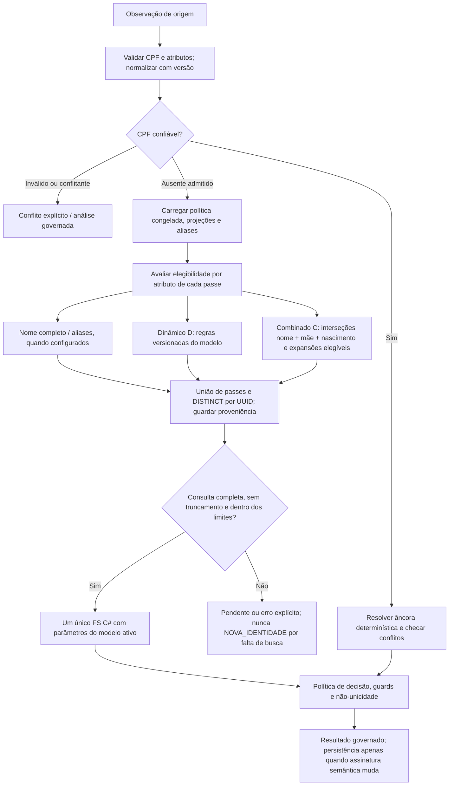
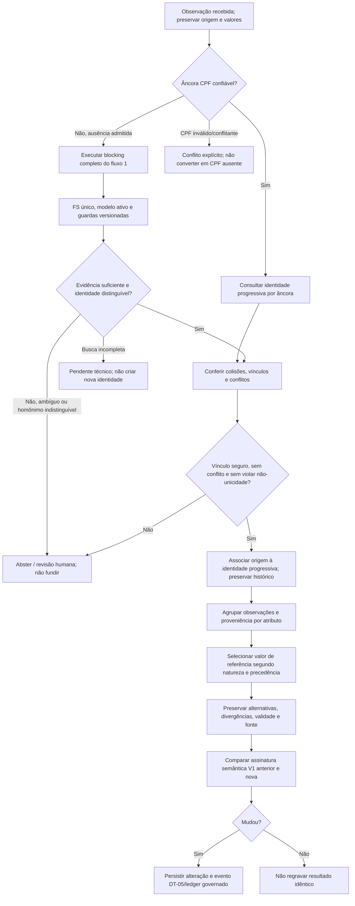
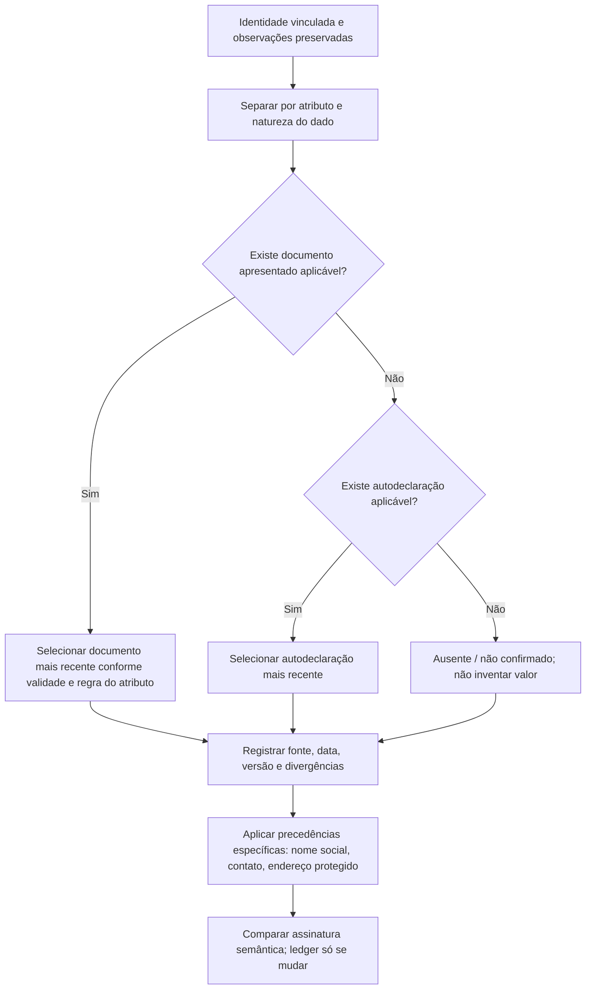
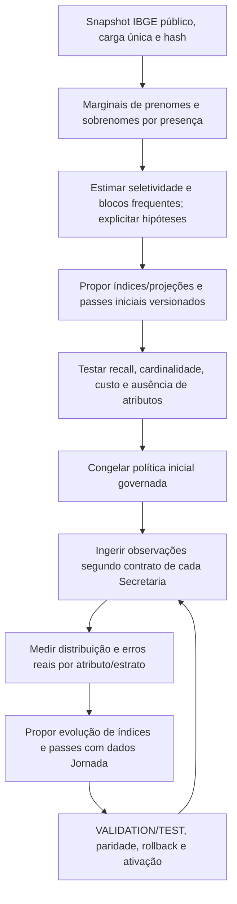

# Fluxos detalhados — blocking e seleção de registro (29/09/2026)

**Estado:** contrato arquitetural documentado; distinguir componentes já implementados de capacidades experimentais. Este documento é Markdown (`.md`) com diagramas Mermaid. Referências: [decisão de blocking](Decisao_Arquitetural_Blocking_Complementar_IBGE_20260927.md), [Calibrador FS](Calibrador_FS_Specification.md), [Plano](Plano_Desenvolvimento.md) e [diretrizes da identidade](Diretrizes_Identidade_Progressiva_Apoio_Decisao.md). **Não** autoriza ativação HML/PROD.

## 1. Fluxo de blocking — recuperação, não decisão

**Invariantes:** CPF estruturalmente válido/confiável segue rota determinística anterior; CPF inválido ou conflitante gera conflito explícito. O `initial_uuid` é proveniência, não evidência. Sem CPF confiável, a política de blocking **congelada e versionada** determina passes elegíveis. Nome completo, dinâmico (D) e combinado (C) são capacidades complementares de uma **única união deduplicada por UUID**; não há três scorers nem escolha antecipada de vencedor. A união completa é entregue ao **único FS C#**. Ausência de mãe ou nascimento desabilita apenas passes que exigem esses atributos; não elimina os demais. Excesso de candidatos, timeout, índice incompleto ou truncamento não significam ausência de identidade.



### 1.1 Composição dos passes

Para cada passe, valores alternativos **do mesmo atributo** compõem OR; atributos exigidos **dentro do passe** compõem AND; passes distintos compõem OR. Exemplo lógico, sem impor um índice SQL físico:

```text
P_i = AND( OR(nome_variantes), OR(mae_variantes), OR(nascimento_variantes), ... )
candidatos = DISTINCT_UUID( UNION(P_nome_completo, P_dinamico, P_combinado) )
```

- **Nome completo:** coincidência normalizada, representações permitidas e aliases históricos. `name_full` e `mother_name_full` são projeções/features; não presumir terceiro executor autônomo.
- **Dinâmico (D):** `BlockingRuleSetSearch` / `BlockingRuleSetCandidatePlanner` consomem regras congeladas pelo Calibrador; não criam regras improvisadas por requisição.
- **Combinado (C):** `CombinedIdentityCandidatePlanner` V1 possui cinco passes no Core e é aditivo na busca semicega quando elegível. **Ainda não está automaticamente publicado no Runner em lote ou no Calibrador.** O diagrama representa o destino arquitetural; execução operacional só inclui passes efetivamente ativados.
- **Índice de sobrenomes:** presença em qualquer posição pode auxiliar a busca. A marginal IBGE de `SOBRENOME` não é probabilidade de último token. Partículas, agnomes, grafias e ausência de campos precisam de teste.
- **Auditoria:** guardar versão de normalização, política/modelo, snapshot de projeção, elegibilidade, passes que recuperaram cada UUID, completude, limites e custos, minimizando PII. Não encerrar após o primeiro candidato.

### 1.2 Avaliação antes de mudar a política publicada

Comparar **D**, **C** e **D∪C** no mesmo corpus, versão, Gold, rótulos, data de corte e orçamento; registrar inelegibilidade de C no denominador comum. Medir recall, verdadeiros exclusivos de cada mecanismo, candidatos distintos, duplicação, FP/FN posteriores ao FS, P50/P95/P99, CPU/I/O e estratos (CPF ausente, mãe ausente, homônimos, erros correlacionados, ondas). Desativar passe só por decisão versionada, não inferioridade de recall pré-declarada, reestimativa de `u` condicionado ao **novo** universo, paridade entre consumidores, rollback e gate de ativação. IBGE é **bootstrap inicial único**; a calibração posterior depende da ingestão da Jornada.

## 2. Fluxo de seleção de registro — recuperação não é identidade

**Separar três atos:** (a) recuperar registros candidatos; (b) decidir vínculo/abstenção/conflito sob modelo e guards; (c) escolher **valores de referência por atributo** para a Gold. O candidato com maior LLR **não** é automaticamente a identidade verdadeira, o primeiro resultado SQL **não** é escolhido, e o registro de uma Secretaria **não** substitui integralmente outro. CPF âncora e código de origem (opcional) não autorizam apagar divergências. A Gold é representação revisável, não certificação civil.



### 2.1 Decisão de identidade

1. **CPF confiável:** aplicar âncora determinística e guardas de conflito; CPF conflitante/inválido nunca entra silenciosamente na rota sem CPF.
2. **Sem CPF confiável:** recuperar a união **completa** de candidatos elegíveis e pontuar no FS C# com `m/u`, prior, threshold e margem do modelo versionado. O `u` operacional é condicionado à união efetiva do blocking.
3. **Não-unicidade:** `EXACT/EXACT/EXACT` pode descrever match e homônimo total. Nome completo, mãe e nascimento exatos não constituem chave única; limiar alto não substitui evidência independente. Guards de conflito e margem podem impor abstenção.
4. **Resultado:** vínculo somente quando autorizado pelas regras; caso ambíguo ou conflito segue revisão governada. Falha de recuperação ou truncamento não autoriza nova identidade. A política de criação de nova identidade deve verificar completude e regras da identidade progressiva.

### 2.2 Seleção de valores Gold por atributo

A hierarquia acordada para atributos **documentais e autodeclarados**, quando aplicável ao tipo do campo, é: **documento apresentado mais recente → documento anterior → autodeclaração mais recente → autodeclaração anterior**. Conservar alternativas e fonte; não substituir essa precedência por “última Secretaria”, “registro mais recente” global, CPF presente ou maior score FS. A precedência específica de nome social/nome de referência e endereço de referência deve seguir suas diretrizes próprias: como chamar ou localizar a pessoa **não é** evidência de quem ela é. Endereço sigiloso/prisional requer restrições próprias e não pode ser exposto como endereço de contato padrão.



**Atenção à implementação:** o Plano lista a conferência/implementação da hierarquia Gold como item 3; esta seção registra a **regra acordada**, não certifica que todos os atributos já a implementam. O mesmo vale para a fila persistente da Trilha 4: mudanças de chaves **antigas e novas**, aliases, Gold, normalização, projeção, passes ou modelo devem reavaliar também registros previamente **RESOLVIDOS** afetados; deduplicar por run/versão, retomar após falhas e gravar ledger apenas quando mudar a assinatura semântica. Aceite integral continua pendente.

## 3. Seleção para atendimento — interface semicega, não auto-vínculo

O endpoint `POST /api/v1/identidade/candidatos` em Development recupera candidatos pelo motor compartilhado e segurança centralizada. Mostra **até cinco**, em **ordem neutra**, sem ranking visível, LLR, score, posterior, CPF ou UUID. Exibe apenas nome completo, nascimento e nome da mãe quando disponível, com `nenhumDestes` sempre presente. O atendente confirma ou rejeita visualmente; **exibição não é decisão automática de vínculo**. Autorização, auditoria anterior à resposta, minimização e finalidade são obrigatórias. A rota permanece fechada fora de Development até gates próprios; não confundir busca semicega com publicação do Runner.

## 4. Gates e estado

- **Implementado/registrado:** motor FS C# único; ruleset dinâmico no Runner; combinado V1 no Core e na busca semicega elegível; endpoint DEV; segregação técnica da Solução de Apoio às Secretarias.
- **Decidido, ainda sujeito a implementação/aceite:** união D∪C no Runner e Calibrador, catálogo ampliado de grafias, V2 municipal, reavaliação temporal completa de RESOLVIDOS, seleção Gold integral por atributo e Ensaio único.
- **Gates:** TRAIN estima `m/u` e seleciona regras; VALIDATION define fronteira e orçamento de FP pré-declarado; TEST apenas audita candidato congelado. `VALIDATE`/`ACTIVATE` são governados, sem promoção implícita. Conferência DT-14 em mudança de scorer/comparadores, migração .NET ou mudança significativa de threshold. CI verde não substitui validação estatística representativa (#31), Ensaio nem autorização institucional.

## 5. Contratos por Secretaria, campos opcionais e dedução inicial dos índices

**Decisão de 29/09/2026:** todos os atributos recebidos de uma Secretaria, inclusive os atributos usados pelo núcleo de identidade única (CPF, nome, nome da mãe, nascimento e identificadores de origem), **podem ser NULL no modelo de observação**. O contrato versionado de cada Secretaria decide quais campos são obrigatórios **na admissão daquela remessa**; não converter uma obrigatoriedade contratual em restrição global NOT NULL na identidade. `codigoPessoaOrigem` permanece opcional. Distinguir `NULL` (ausente), valor inválido, valor explicitamente divergente e atributo não fornecido pelo contrato. Uma remessa que viola seu contrato deve ser rejeitada ou colocada em pendência contratual com motivo auditável, não transformada em dado fictício. Observações admitidas com evidência insuficiente permanecem não resolvidas; ausência de CPF não é conflito, e ausência simultânea dos atributos não autoriza vínculo nem nova identidade automática.

**IBGE e o índice inicial:** o snapshot censitário imutável, carregado uma vez antes da primeira Entrega, também alimenta a **dedução inicial da política de índices/projeções e passes de blocking**, não apenas o `u` nominal do FS. Usar marginais publicadas de prenomes e sobrenomes por presença para estimar seletividade de chaves e combinações, identificar blocos muito frequentes e planejar índices e passes complementares. A frequência censitária de sobrenome em qualquer posição **não** estima diretamente a frequência do último token, e o IBGE **não** fornece a distribuição conjunta pessoa+mãe+data: combinações iniciais são hipóteses calculadas e precisam de validação com corpus e ingestão real. Persistir regras, versão, método, recorte, manifesto/hash e métricas de origem. A partir da ingestão, atualizar/avaliar os índices e passes com distribuições observadas da Jornada, sem reler, revalidar ou recalcular o IBGE em cada geração. Mudança de política é versionada, medida em D/C/D∪C e submetida aos gates de recall, custo, `u` condicionado, rollback e ativação; não alterar silenciosamente modelos anteriores.



**Elegibilidade com NULL:** um passe que exige mãe não é executado quando mãe está ausente; outro passe elegível continua. Sem atributos suficientes para qualquer passe, registrar `EVIDENCIA_INSUFICIENTE_PARA_BLOCKING`/pendência governada, sem inventar CPF, nome, data ou vínculo. Índices SQL de busca devem tratar NULL sem equipará-lo a uma chave compartilhada entre pessoas; o contrato controla a entrada, enquanto o motor controla a suficiência de evidência para cada operação.
