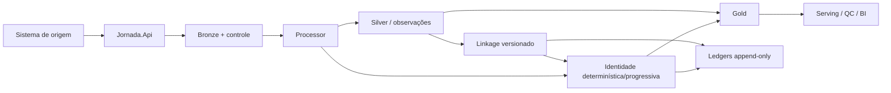
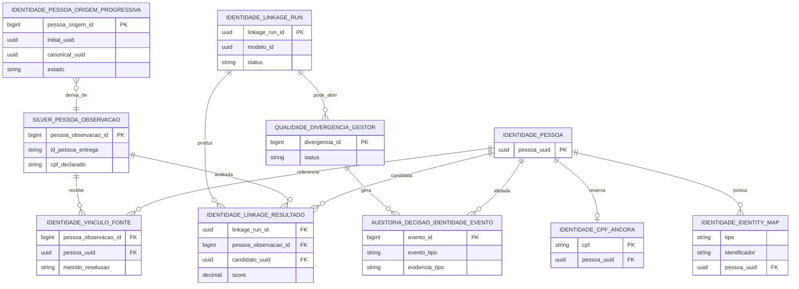

# Invariantes arquiteturais — Jornada do Cidadão

**Status:** fonte canônica de invariantes técnicos do primeiro trem pós-RC  
**Baseline de implementação conferido:** `08ca8fc0effbbeba6f8cdb8ba6a671329eb01b0a`  
**Escopo:** invariantes já implementados ou explicitamente fail-closed; decisões institucionais pendentes continuam em #379/#378.

Este documento não cria política de Produção. Ele nomeia propriedades que a implementação corrente já deve preservar e serve de índice para testes, diagramas e revisões.

## Regra de precedência

Especificação Técnica vigente → requisitos normativos → arquitetura corrente → contratos executáveis → implementação. Um diagrama ou comentário não pode criar comportamento implícito.

## Catálogo

| ID | Invariante | Natureza |
|---|---|---|
| INV-FATO-001 | Fato finalístico válido não é descartado nem bloqueado porque a identidade está pendente, indefinida ou em conflito. | Produto |
| INV-GOLD-001 | Correção de identidade altera atribuição/projeção de identidade; não reescreve silenciosamente o fato declarado pela origem. | Produto |
| INV-CPF-001 | CPF válido/confiável possui âncora permanente CPF→UUID; Linkage não transfere nem recicla a âncora. | Identidade |
| INV-ORIGEM-001 | `initial_uuid` preserva proveniência/continuidade da origem; não é feature, label, blocking key ou score. | Identidade |
| INV-SECID-001 | NIS/PIS/PASEP/NIT e RG são identificadores secundários; não constituem Pessoa nem escrevem `identity_map` automaticamente. | Identidade |
| INV-LINK-001 | Blocking reduz candidatos; nunca decide identidade. | Linkage |
| INV-LINK-002 | Resultado bruto do scorer e decisão operacional publicada são camadas separadas e versionadas. | Linkage |
| INV-LINK-003 | Modelo/ruleset/parâmetros são consumidos pela versão exata; não se mistura proveniência entre versões. | Linkage |
| INV-LINK-004 | Execução incompleta, timeout ou universo truncado não equivale a “sem candidato”. | Linkage |
| INV-CONF-001 | VALIDATE/ACTIVATE exigem conferência `CONFORME` da mesma `modelo_id` quando o contrato de tolerância estiver congelado. | Governança de modelo |
| INV-LEDGER-001 | Ato governado de identidade e seu evento de auditoria são atômicos; ledger é append-only. | Governança |
| INV-MODEL-LEDGER-001 | Mudança de estado do modelo possui trilha append-only própria; monitor não promove modelo. | Governança |
| INV-API-001 | `Jornada.Api` é porta de entrada e escreve ingestão/Bronze/controle; Processor/Linkage executam Silver/Gold/identidade. | Fronteira |
| INV-SEC-001 | Fora de Development, ausência da identidade/autorização corporativa real mantém o sistema deny-by-default/not-ready. | Segurança |
| INV-SIGILO-001 | Endereço de casa-abrigo sigilosa não alimenta Linkage nem referência territorial fina compartilhada. | Segurança |
| INV-REPLAY-001 | Replay com a mesma decisão/evidência versionada é idempotente e não apaga histórico. | Operação |

## Visão de dependências

O diagrama é uma visão de revisão no repositório. Em entrega institucional, a figura deve ser renderizada e incorporada ao DOCX/PDF; o leitor final não depende de Mermaid.

## ER do núcleo de identidade

O DER abaixo é visão física auxiliar, não UML.

## O que ainda não é invariante de Produção

Não congelar aqui: limiares estatísticos, largura de zona cinzenta, scopes definitivos do balcão, RPO/RTO, política de retenção, ferramenta de monitoramento, autenticação PRODAM ou base legal/finalidade. Esses pontos permanecem em #31/#93/#378/#379/#408.
