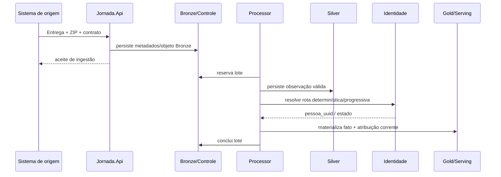
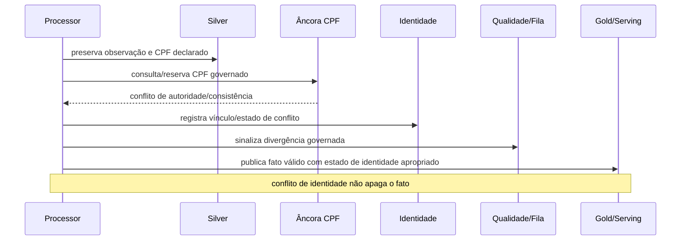
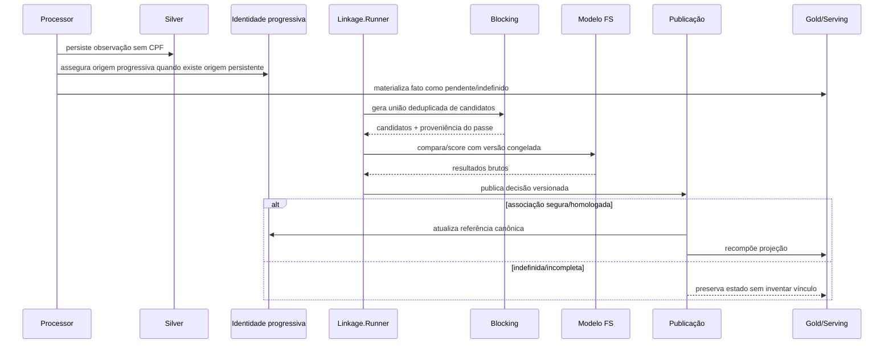
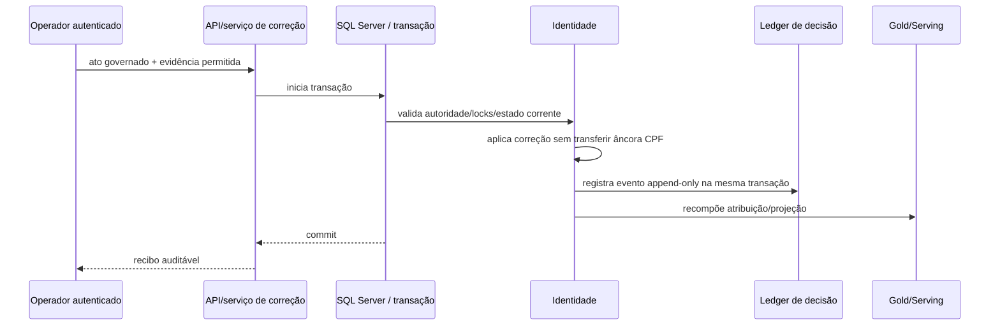
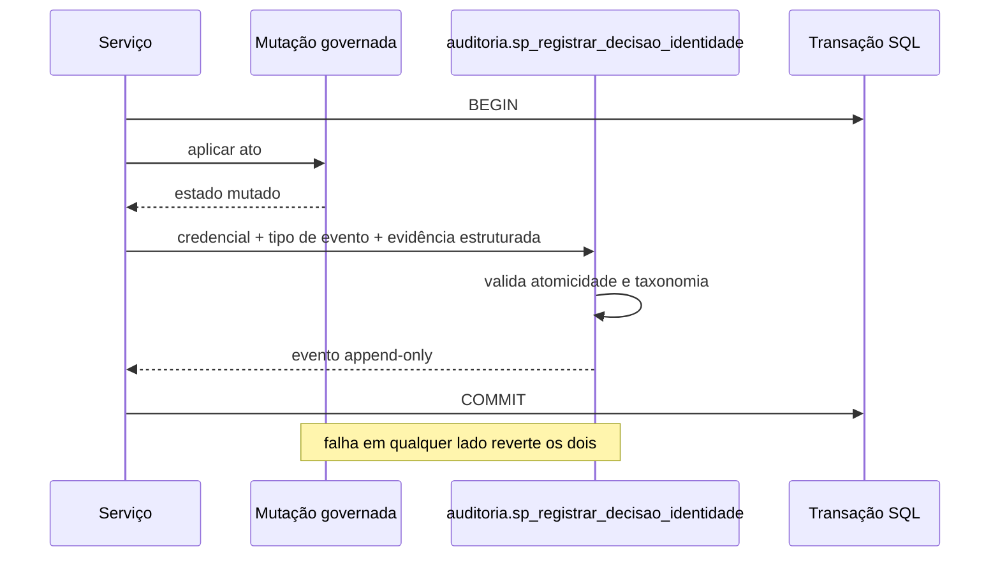
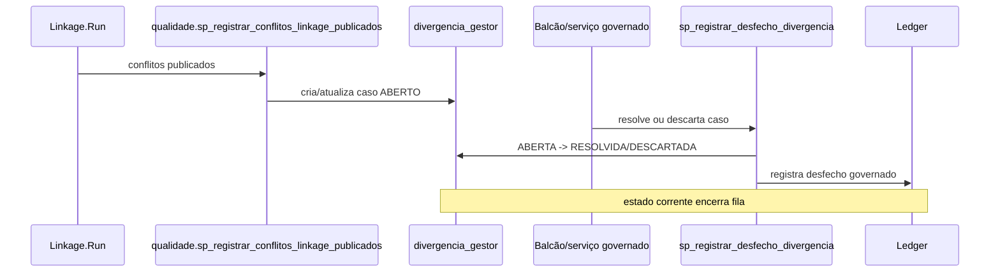

# Sequências correntes — fato, identidade, ledger e fila governada

**Baseline conferido:** `08ca8fc0effbbeba6f8cdb8ba6a671329eb01b0a`  
**Substitui como visão de revisão corrente:** os quatro fluxos de sequência originalmente mantidos em `docs/diagrams/sequence/01..04`. Os arquivos PlantUML/PNG/SVG anteriores permanecem no histórico até a limpeza controlada; não devem ser usados para inferir comportamento quando divergirem deste documento e dos contratos executáveis.

Os diagramas Mermaid são fonte de revisão no GitHub. DOCX/PDF devem incorporar imagens renderizadas.

## SQ-01 — fato com identidade resolvida

**Invariantes:** INV-API-001, INV-FATO-001, INV-GOLD-001.

## SQ-02 — CPF em conflito

**Invariantes:** INV-FATO-001, INV-CPF-001, INV-GOLD-001.

## SQ-03 — sem CPF, Linkage posterior

**Invariantes:** INV-FATO-001, INV-ORIGEM-001, INV-LINK-001..004.

## SQ-04 — correção governada

**Invariantes:** INV-CPF-001, INV-GOLD-001, INV-LEDGER-001, INV-REPLAY-001.

## SQ-05 — ledger de decisão de identidade

Confirmação humana usa `DOCUMENTO_VERIFICADO` ou `CONFIRMACAO_INSTITUCIONAL_SEM_DOCUMENTO`; evento sem confirmação usa evidência nula. Identidade individual definitiva do operador permanece dependente de #378.

## SQ-06 — fila governada de divergência

### Lacuna explicitamente aberta

O fluxo corrente encerra a fila, mas ainda não prova que a causa material desapareceu. A #401 é a fonte canônica para adicionar fingerprint/supressão versionada: mesma evidência não deve recriar infinitamente o caso; evidência materialmente nova poderá reabrir conforme regra explícita. O diagrama não antecipa essa implementação como se já existisse.
